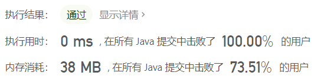
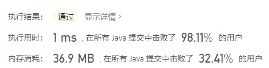

# 2021-2月LeetCode

## 2021/2/6

### 1672.[最富有客户的资产总量](https://leetcode-cn.com/problems/richest-customer-wealth/)

​	本题很简单，就是两层循环解决问题，不过我看了一些人的评论，解题思路和我大致相同，但有可以优化的地方。

第一次通过的代码:

```java
class Solution {
    public int maximumWealth(int[][] accounts) {
        int max = 0;
        for (int i = 0; i < accounts.length; i += 1) {
            int temp = 0;
            for (int j = 0; j < accounts[0].length; j += 1) {
                temp += accounts[i][j];
                if (temp > max) {
                    max = temp;
                }
            }
        }
        return max;
    }
}
```

优化后的代码：

```java
class Solution {
    public int maximumWealth(int[][] accounts) {
        int max = 0;
        for (int i = 0; i < accounts.length; i += 1) {
            int temp = 0;
            for (int j = 0; j < accounts[0].length; j += 1) {
                temp += accounts[i][j];
            }
            if (temp > max) {
                max = temp;
            }
        }
        return max;
    }
}
```

​	两者的唯一区别在于将判断条件放在循环外与否。对于是否是最富有的客户，第一次写时我将判断条件放在了双层循环内，相当于每加一次判断一次，其实这样是没有意义的。应该在每次计算完一个客户的总资产后再进行比较，也就是在第一个循环中比较，这样时间提高了许多。



### 771.宝石与石头

简单题。[链接](https://leetcode-cn.com/problems/jewels-and-stones/)

```java
class Solution {
    public int numJewelsInStones(String jewels, String stones) {
        List<Character> list = new ArrayList<>();
        int sum = 0, typeLen = jewels.length(), stonesNum = stones.length();
        // init
        for (int i = 0; i < typeLen; i += 1) {
            list.add(jewels.charAt(i));
        }
        for (int i = 0; i < stonesNum; i += 1) {
            if (list.contains(stones.charAt(i)))
                sum += 1;
        }
        return sum;
    }
}
```

