# 《区块链技术与应用(北大-肖臻)》

## BTC

### 密码学原理

- 关于哈希函数的三个性质

  1. collision resistence

     对于哈希函数（使用H(x)=digest来描述），因为其输入x的范围是无限的，而在BTC中，其使用的是SHA256，也就是说其结果仅仅有2^256个，总不能避免哈希碰撞的存在。

     > 但是它在实际中是不能证明的，只能理论上认为其存在。

  2. hiding

     但是如果给定一个digest，我们很难找到一个对应的x使得H(x)=digest（除非使用brute-force），它在现实中是无法人为制造的，只能通过实践经验得来，这也就造成了hiding。

     > 可以结合collision resistance实现digital equivalent of a sealed envelope，也就是事先将digest公布出来，在预测结果出来之后将x公布，比较H(x)和digest，即可得出预测是否被篡改。

  3. puzzle friendly

     哈希值是不可事先预测的，比如在BTC中，规定哈希值前n位为0（000...XX...XX），我们无法通过非蛮力的方式来取得规定的哈希值。这个在BTC中可以当作proof of work。（求解很困难，但验证很容易，所以一般也成为difficult to solve, but easy to verify）

- 密码学中的公私钥

  主要讲了其基本原理，以及其相比于对称密钥的好处和签名的实现原理等，这里略过。

### 数据结构

- 区块链其实就是一个个使用区块连接起来的链表，其与普通链表不同的就是其指针为**哈希指针**，好处在于它不仅能够表示存放位置，还能够表示区块的哈希值（可以查看区块链是否发生篡改）。

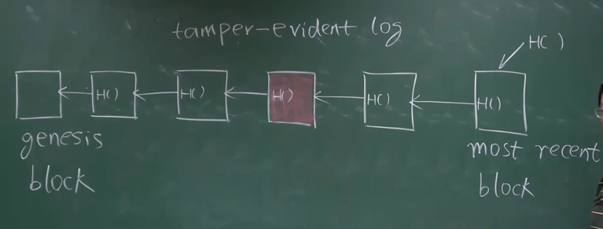

对于上图中所示，其表示的就是一个简易的区块链，在区块链上每个哈希指针代替了普通指针，对于genesis block（也就是创世区块）之外的所有区块，其都包含一个指向前一个区块的哈希指针，其哈希值等于前一个区块的**所有内容**（包括前一个区块的哈希指针）。

>当我们想要判别区块链中是否出现了篡改，我们可以查看指向最后一个区块的哈希指针，将其中的哈希值与我们**系统中保存的指向最后一个区块的哈希值**进行比较，即可发现是否发生了篡改。

- Merkle tree

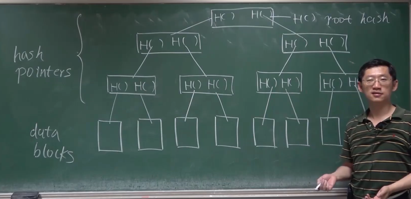

上图是一个Merkle tree的示意图，其与binary tree类似，不过指针是哈希指针，其原理和之前所描述的链表形式的区块链类似，它在根结点处取了哈希放到系统中保存，用来判断是否发生了篡改。

另外，区块的交易使用Merkle tree来描述，在Merkle tree中有存在有块头和块身（block header、block body），在块头中只存放根哈希值，没有交易信息的具体内容，而块身中则存放了交易的具体内容。

- Merkle tree的作用：

  提供**Merkle proof**。

  (补充：BTC中的节点分为全节点（保存区块的所有内容，包含块头和块身，有着完整的交易信息）和轻节点（只有块头，包含了根哈希值）)

> 如何向一个轻节点判断一个交易是否包含在其中呢？
>
> 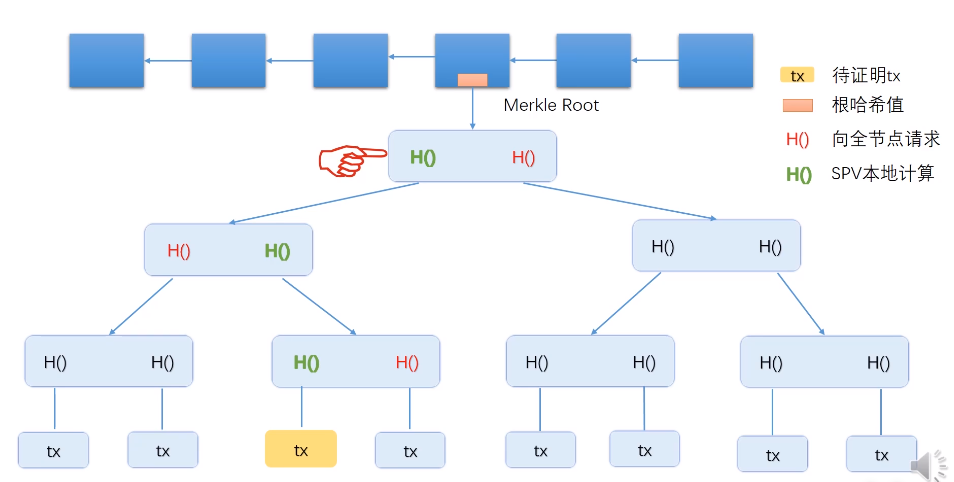答案：通过上图可以看出其为一个区块的Merkle tree，tx为需要进行证明的transaction，对于一个轻节点，其中只包含一个根哈希值（没有详细的交易信息)，这是轻节点可以向全节点进行请求上图中红色的哈希值（Merkle proof)，而根据黄色可以计算出绿色的哈希值，最终计算出来哈希值，将其与系统中保存的根哈希值比较，来判断是否包含在其中。**时间复杂度为$\theta(logn)$。**
>
> （注：由于Merkle proof可以证明交易的存在性，所以它又被称为proof of membership/proof of inclusion）

由上，也可以验证proof of nonmembership。方法一为获取全节点，然后逐一进行比较，其时间复杂度为$\theta(n)$。方法二是将Merkle tree根据哈希值进行排序，然后对哈希值进行匹配，其时间复杂度为$\theta(logn)$。（但是BTC中并没有使用排序树，所以BTC中不需要不存在证明）

### 协议

- 引言：

在现实世界中的货币都是由一个中央银行同一印发的，是中心化的。但是在数字货币中不是这样，假如数字货币也是中心化的，此时CB(中央银行)发行了一个用自己私钥签名的100元货币给用户A，用户A将货币花完后不满足，重新复制了一份出来（因为数字货币和纸质货币是不一样的，它可以复制），这样就造成了一个双花攻击(double spending attack)。<数字货币所面临的主要问题就是解决双花攻击>。

对于上述的中心化的机构，可以使用一个很大的数据表来保存CB与用户以及用户之间的交易记录，从而来解决上述问题。

那么有没有一种去中心化的数字货币呢？去中心化数字货币面临的问题主要有两个：

1. 数字货币的发行
2. 怎么验证交易的有效性，防止double spending attack。

> 在Bitcoin中，比特币的发行是由挖矿决定的，并且其依靠与区块链这一数据结构。

- 实际例子解释

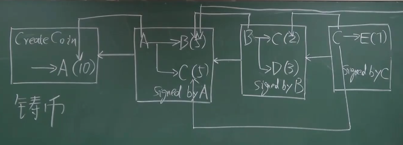

对于上图，最左边的CreateCoin表示A拥有了铸币权，他发行了10个比特币，那么在后面的一个区块中表示A向B和C分别转了5个比特币。

在比特币系统中，为了说明交易是有效的，每个交易都需要有输入和输出，输入部分是币的来源，它表明了币不是凭空捏造的，输出部分要说明收款人公钥的哈希，它表明了币的去向。

在上图中，A在转完10个币之后，B和C分别拥有了5个币，随后B又向C和D分别转了2个和3个比特币（注意其输入输出），此时C有了7个币，那么C又向E转了7个币（注意其输入有两个地方），这构成了一个小型的区块链。

> 注：在上图中，其实存在两种哈希指针：一种是之前在数据结构部分说明的哈希指针（如下图的1、2、3），它将区块串联起来变成一个链表；另外一种是指向前面某个交易的指针（如下图的4、5、6），用来表示币的来源（它可以说明币不是凭空捏造的，也可以防范double spending attack）。
>
> 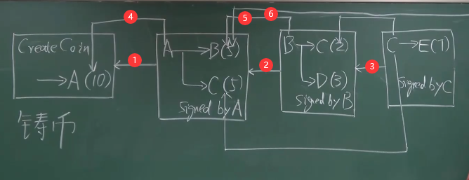
>
> > - 指向交易的指针防范double spending attack的流程。
> >
> > 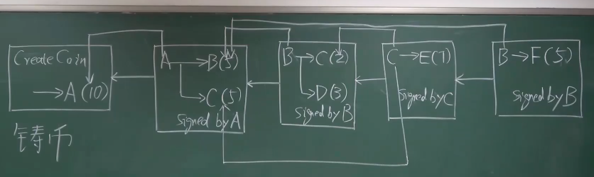
> >
> > 如图，在B向将自己的币转给C和D后，自己已经没有币了，但是此时如果B伪造一个交易，即发送5个币给F。此时其他用户可以根据哈希指针逐层验证其合法性，发现B之前已经将自己的币完全转走了，无法再进行转账，此时就可以防止其伪造。

---

对于一个交易，我们已经有了其输入，那么既然是转账操作，其就要有发送方和接收方，对于发送方而言，其必须明确了接收方的地址才能顺利完成转账。

例如在上面的例子中（第二个区块），A向B转了5个币，A需要知道B的地址，在比特币系统中，收款的地址是通过公钥推算出来的（并不是公钥，而是将公钥哈希后再变换得到的）。

那么此时A知道了B的地址，B需要知道A的什么信息呢？B其实要知道A的公钥，这代表了转账人A的身份。不仅是B，所有的节点都应当知道A的公钥，以用来验证交易的合法性（区块由A的私钥签名，需用其公钥验签）。

那么如何才能得到A的公钥呢？可以直接使A来提供自己的公钥吗？答案是否定的，因为假如此时有一个A'来冒名顶替A，将自己的公钥声称为A的公钥，并且用自己的私钥来对区块签名，那么其他的节点会认为这个是合法的，A的钱不就凭空消失了嘛?所以这是有安全漏洞的！在现实中，铸币交易的输出包含的A的公钥的哈希，这样既可以在第二个区块中将A的公钥和之前的哈希对上。

在比特币系统中，这些验证过程都是通过执行脚本来实现的，之后再详细阐述。

---

在上面的例子中，我们每个区块只包含了一个交易，但在实际中，每个区块可以有很多交易，交易的形式由Merkle tree来表示。

每个区块包含块头和块身，在块头中包含了区块的宏观信息，如：version(比特币哪个版本的协议)、hash of previous block header(前一个块头的哈希值)、merkle root hash(区块中merkle tree的根哈希值)、target(挖矿的难度目标值)、nonce(随机数)。

其中target就是控制难度的指标，即H(block header) <= target，在block header中存放了目标预值的编码(nBits)。

> 注：块头中的哈希应当指向前一个块头，而不是整个区块（因为块头中的Merkle root hash已经保证了block body中的交易没有篡改），所以哈希指针指向区块中间位置是不正确的，应当指向其头部，画法如下。
>
> 

另外，之前提到过节点分为全节点(full node)和轻节点(light node)，全节点包含了区块的所有交易信息，可以用来验证交易的合法性，所以有称为fully validating node，而轻节点仅仅包含了block header的内容，无法独立验证交易的合法性。（我们的内容主要讨论全节点）

- 比特币中的共识协议

在比特币系统中，由于不能保证所有的节点都是友好的没有恶意的，所以需要设计一种共识协议来达成一致。

假设我们使用现实生活中常见的投票方案，超过半数则通过。但由于比特币系统中无法确定哪些节点是恶意的，也就是无法说明投票的有效性和正确性，所以我们需要对将投票权限制一下，也就是确定一下membership再进行投票，这种方案是可行的。

但是比特币系统中创建用户十分容易，几乎不需要成本，只需本地创建公私钥对即可，如果不与外部发生交易，任何人都不可能发现这些用户，也就是说假如有些人不停的创建账户，在账户超过半数时就有了比特币系统的控制权，这种称为sibil attack（女巫攻击），所以投票不可行。

比特币账户很巧妙地解决了这个问题，它允许所有节点在本地组装候选区块，然后将其认为合法的交易放入其中，然后尝试不同的nonce来达到H(block header) <= taget的要求。如果某个节点率先找到了nonce，那么它就获得了记账权。

对于获得了记账权的区块，它可以往比特币帐本中写入下一个区块，其他节点可以验证这个区块的合法性，比如查看其block header中的域(nBits)是否符合难度要求，生成的nonce与block header的哈希值是否小于target，假如都满足要求，再检查交易列表中的交易是否合法：是否有合法签名、以前没有被花过。如果有任一条件不符合，则不予接受；而即使所有条件都符合，也不一定接受。

---

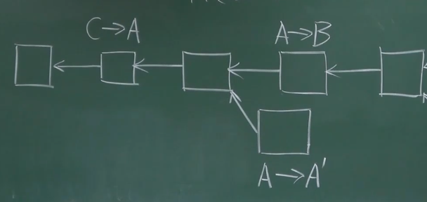

见上图，假如此时有一个合法的区块（下面的那个A->A'的）插入到了区块链中，怎么知道其插入的位置呢？

对于下面的区块，其插入相当于是一个分叉攻击(forking attack)，区块如果想要鉴别接收哪一个区块为合法的，需要遵循最长合法链原则(longest valid chain)，而下面的区块明显不在最长链上，所以其不被接收。

但是在现实中，很有可能出现这种分叉的情况，比如：两个节点几乎同时获得记账权，并且几乎同时将区块写入，此时就会出现两个等长分支，也就是说这两条暂时都符合最长合法链，那么该如何处理呢？在比特币协议中，各节点因为网络延时问题先接受最早收到的那个（也就是在收到的这个后面写入区块），之后持续一段时间，直至两个链分出胜负，成功的就是最长合法链，另外一个就是orphan block。

- 比特币的奖励机制

上面的记账机制设计的很好，可我一个节点为什么没事浪费自己的计算资源来给你记账呢？为了解决这一问题，比特币中设计了其奖励机制(block reward)。

在比特币协议中规定，获得记账权的节点在发布的区块里可以有一个特殊的交易：铸币交易。在这个交易里面可以发布一定数量的比特币。

比特币的发行就是coinbase transaction，它是比特币系统中发行新比特币的唯一方法（其余交易只不过都是币的转移，而不是币的产生），由于是“铸币”过程，所以这种交易可以不用指明币的来源。

在比特币刚上线时，每个新发布的区块可以产生50BTC(BTC是比特币的符号)，每新产生21万个区块，出块奖励就减半，也就是变为25BTC，以此类推。

> 联系上面的分叉，由于分叉的存在，会有一个最长合法链和一个orphan block，比特币会产生给最长合法链，之前失败的orphan block就作废了，所以相当于白算了2333。

**问题**：比特币系统中需要取得的共识到底是什么？

比特币是去中心化的系统，所以其需要取得的共识就是一个巨大的账本。其中只有拥有了记账权的节点才可以写东西。为了争夺记账权，所有节点开始计算nonce（这个过程没有捷径，只能暴力求解，所以是公平的），这就是挖矿的过程。所以归根结底，比特币的共识机制是基于算力的，而不是基于投票的，所以它完全避免了sibil attack（女巫攻击）。

比特币争取记账权的过程叫做挖矿(mining)，比特币被称为数字黄金(digital gold)，争夺记账权的节点被称为矿工(miner)。

### 实现

由于区块链是一种去中心化的账本，所以无法直接的得到某个用户的余额。如果想要得到则需要从全节点中追溯交易信息，进而计算出对应用户的账户余额。

- UTXO

在比特币系统中存在一种数据结构UTXO(Unspent transaction output)，其中包含一些没有花费的交易信息。在区块链上的交易，所有没被花掉的输出的集合就叫做UTXO。

一笔交易中可能存在有多个输出，因为一笔交易可以由一个用户向多个用户转账。例如：A向B、C分别转了5BTC，但B将这5个BTC花掉了，所以此时UTXO中就没有了A->B的这个输出。在UTXO集合中每个元素都要给出产生输出这个交易的哈希值，以及它在交易中是第几个输出，这样就可以定位到UTXO中的输出。

> UTXO的作用是什么？
>
> 答：可以防止double spending。当发生一笔交易时就可以在UTXO中查询其合法性，以便全节点快速检测double spending。

在交易中有输入和输出，所以在交易消耗一部分输出的同时也会产生一些输出。例如对于上面的例子，假如B花掉5个BTC，那么这个交易就不再UTXO中，但他如果转给D，D没有花掉，则这个交易就始终存在UTXO中，如果D始终不花，则这个信息要永久保存在UTXO中。

- 交易

每笔交易有多个输入和输出，原则上所有输入金额之和应于所有输出金额之和相等，即total inputs = total outputs。因此一个交易可能来自多个地址，可能有多个签名。

但也有些交易total inputs 略微大于total outputs，是因为其中有一小部分费用用作了交易费，给了获得记账权的发布区块的节点。

- transaction fee

很多时候并不是所有的获得记账权的节点都会老老实实记录交易，因为验证交易和打包交易都要消耗资源，对自己没有好处。因此在比特币系统中设计了第二个激励机制：交易费(transaction fee)，对于获得记账权的节点可以将合法交易打包到区块中，并获得一部分小费，这样就提高了其积极性。（虽然交易费很少）

- 比特币的总量

在比特币刚刚发行的时候，它的每个出块奖励为50BTC，它规定每出现21万个区块则奖励减半，也就是在出现21万个区块后50BTC->25BTC，目前已经到了12.5BTC的时代。由于每个区块的出块时间在10min，21万个区块大概需要挖4年，所以计算一下可以得到其总量在2100万个。

> 比特币中其模式为基于交易的模式(transaction-based ledger)，它的隐私保密性比较好。而除了这种交易模式外，以太坊的模式为基于账户的模式(account-based ledger)，这种模式下，系统需要显示记录每个账户的币总数。
>
> 那么，哪种更好一点呢？（值得思考）

- 区块的具体例子（比特币中）

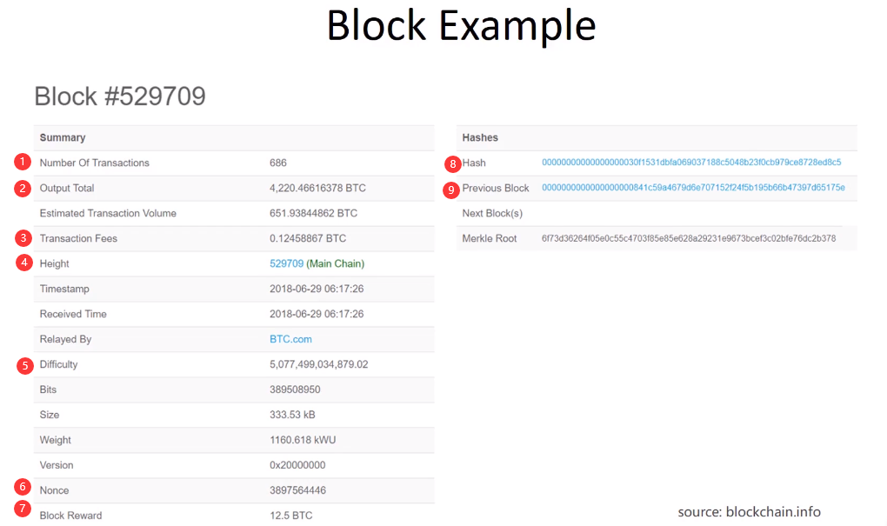

上图是一个比特币系统中的区块实例，下面使用序号对其进行描述：

1. 该区块所包含的交易数量
2. 交易总共输出的比特币总量
3. 交易费
4. 区块的序号
5. 挖矿的难度（每隔2016个区块会调整一次挖矿的难度，保持出块时间平均在10min左右）
6. 挖矿时使用的随机数
7. 区块奖励
8. 当前区块**块头**的哈希值
9. 前一个区块块头的哈希值
10. （未标号/右侧最后一行）Merkle tree的根哈希值

> 通过观察可以发现当前区块和前一个区块块头的哈希值前面都有一大串00000...，其实这就是设置的目标预值的十六进制，它是通过大量尝试计算得出来的。

- 区块头的数据结构

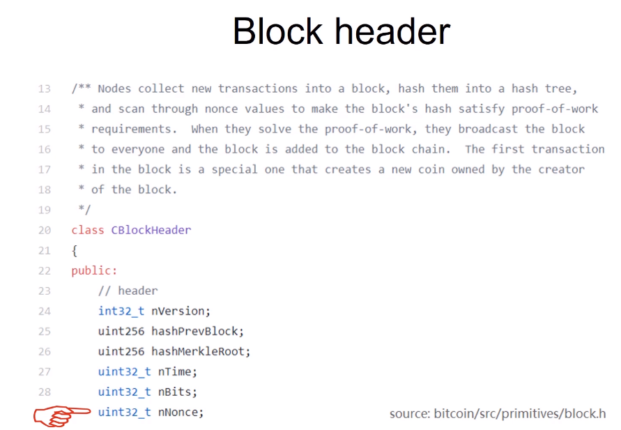

通过查看其数据结构我们可以发现，其nonce值是一个32bit的无符号整数，也就是说它最多只有$2^{32}$个随机数，由于比特币是基于算力来进行竞争达到共识的，在如今这么猛烈的计算环境下，计算的值符合目标预值的难度很大，很有可能将随机数全部用完都找不到合适的哈希值。那么有没有其他可以改变的值来成为我的extra nonce呢？

让我们再来看一下区块头的具体描述：

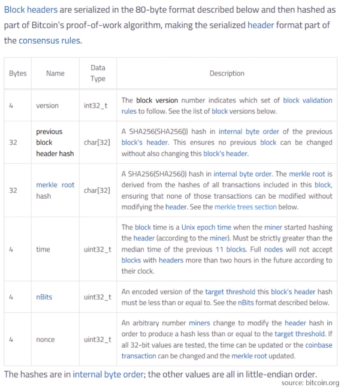

通过表格从上到下依次为：

1. 比特币协议的版本号(无法更改)
2. 前一个区块头的哈希值(当然无法更改)
3. merkle tree的根哈希值(可以更改吗？)
4. 时间戳(理论上来说可以调整，因为在比特币系统中并不要求特别精确的时间，可以在适当的范围内调整)
5. 目标预值<编码后的版本>(不能随意调整，只能按协议中定期调整)
6. 随机数

其实，merkle root hash是可以更改的。（它看起来十分不合理，因为它代表交易没有更改，它更改了不就代表交易被篡改了嘛？当然是这样，但不要忘记了每一个区块中都会有一个CoinBase tx，它是可以更改的！）

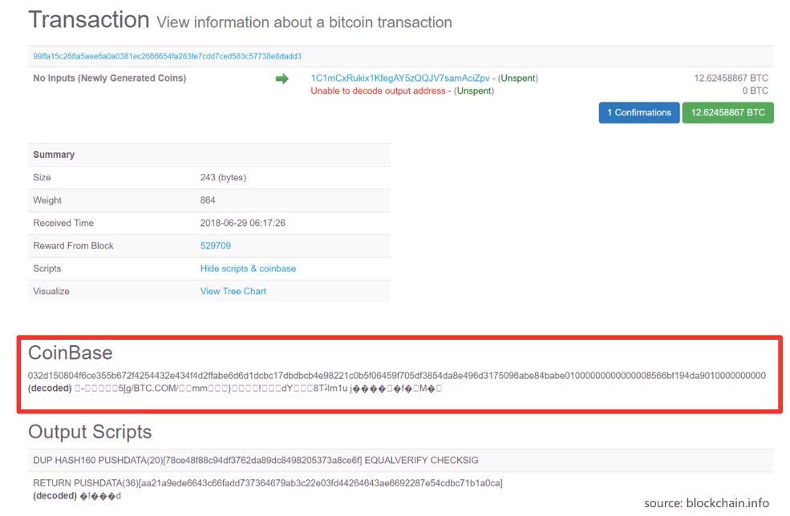

在铸币交易中，其中有一个CoinBase，其中可以写任何内容，因为这部分的内容没有人会检查，那么我们就可以利用这个域来当作我们的extra nonce来使用。

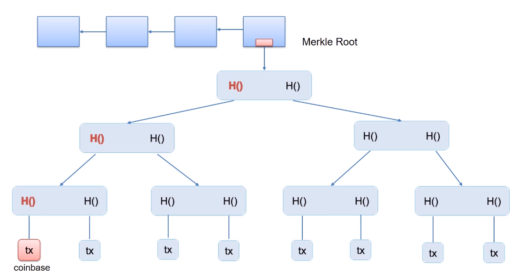

通过更改左下角coinbase tx中的coinbase域，就会使得它出现一种“多米诺骨牌效应”，使得merkle tree的根哈希值进行改变。当块头中4byte的nonce不够用时，我们可以使用coinbase域中的前8byte当作extra nonce来用，这样搜索空间就一下增大到了$2^{96}$个。

> 根据上述描述，在现实生活中挖矿时会有两层循环，外层循环调整coinbase域中的extra nonce，算出merkle tree中的根哈希值后再内层循环调整header中的nonce。

- 普通的交易

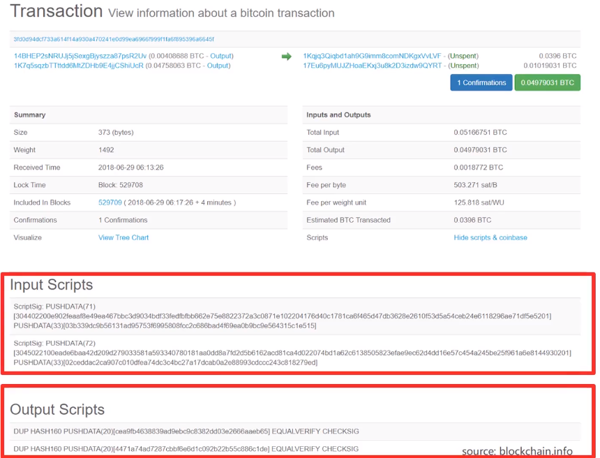

通过观察交易信息可以发现其total input / total output / fees等，其中下面红线标注的是两个脚本，分别是当前交易的输入脚本和输出脚本。在比特币系统中，对于验证交易的合法性，只需要将输入脚本和输出脚本拼接在一起运行即可，如果运行成功，则代表交易合法。

> 注：上面指的输入脚本和输出脚本不是指将当前交易的输入脚本和输出脚本进行拼接，而是将当前交易的输入脚本和提供币来源的交易的输出脚本进行配对！

- 比特币系统的数学支撑

挖矿的每次尝试一个nonce可以看作是一个Bernoulli trial(伯努利实验)，而一系列的伯努利实验就构成了一个伯努利过程。它有一个很重要的性质：memoryless(无记忆性)。<无记忆性就是指你上次成功与否与下次成功与否没有关系>

在大量的试验下，由于成功概率很小，那么此时使用泊松分布来代替伯努利过程，其分布图像大致如下：

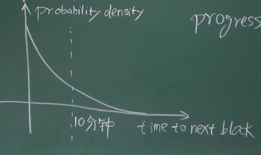

上图代表了比特币系统整体的概率分布曲线图，横轴代表系统出块时间，纵轴代表概率密度。如果将其具体到单个矿工上，那么矿工挖到下一个区块的时间区别于他本身所占系统算力的百分比。

另外，指数分布也是memoryless的。因为概率分布曲线的特点是：随便从一个地方截断，剩下的一部分曲线根原来是一样的。(比如：已经等了十分钟了，还没人找到合法的区块，那么还需要多久呢？根据概率密度函数分布，平均仍然需要等十分钟。也就是说将来需要挖多久，与之前挖了多久是没有关系的，这个过程也叫做progress free)。

> 恰恰是progress free的性质保证了比特币系统的公平性，因为在这种条件下算力强的矿工有着成比例的优势，它是挖矿公平性的保证。

- 人类的思考

问：比特币随着时间越来越难挖到是不是因为随着比特币发行的减少而设置的难度越来愈高，所以大家在挖比特币时越来越难了？

答：不是。比特币越来越难挖到是属于人为因素的限制，而不是其问题求解的难度越来越高。（也就是求解问题难度是根据算力来变化的，不是时间越长就越难解，从“感觉上”认为比特币越来越难挖是因为其发行数量在人为减半，所以“显得”比特币比较难挖了）

> 补充：比特币求解puzzle的过程就是挖矿，它看起来是毫无意义而且是浪费资源的，但挖矿的过程对于维护比特币系统是至关重要的。因为挖矿提供了一种凭借算力投票的方式，只要大部分算力在诚实的节点手里，比特币系统的安全性就可以得到保障。
>
> 所以有一种说法叫做Bitcoin is secured by mining.

问：随着时间的推移，比特币挖矿的奖励在递减，那么会不会出现人类对比特币挖矿的欲望减小呢？如果最终区块奖励趋近于0时，会不会就没有动力挖矿了呢？

答：不会。在比特币系统中有两种奖励机制，一种是block reward，另外一种就是transaction fee。当区块奖励趋近于0时，矿工就会选择获得交易费来作为挖矿的继续理由。

- 比特币系统中可能存在的攻击手段？

在比特币系统中，所有节点的竞争是依靠算力的，而并不是所有的节点都是诚实的节点，仍有可能存在恶意节点获得记账权的可能性，那么假如恶意节点获得了记账权，它可能会做出什么非法行动呢？

**假设一**：恶意节点能不能偷币？（即将别人账户上的钱转到自己账户上）

答：答案显然是否定的。由于每笔交易都使用了私钥进行签名，而恶意节点无法获取其他人的私钥，所以它无法伪造别人的签名来实施对自己的转账操作。

**追问**：那如果它硬要将交易写入区块链呢？

答：假如恶意节点硬要写入非法区块，当诚实的节点验证交易时都不会接收这笔非法交易，它们会继续沿着前一个区块挖，进而生成新的合法的能让大多数合法区块达成一致的区块。这样下来，恶意节点既丢失了出块奖励，又没有转账成功，代价是十分大的。

**假设二**：恶意节点能不能实现将已经花过的钱再画一遍呢？(即double spending，将自己花过的钱重新回滚一下)

答：可以分两种情况。假设恶意节点是M，第一种情况下M已经在前一个区块中完成了一笔交易M->A，此时它获得了记账权，所以它伪造了一个M->M'的交易将钱转回给自己，如下图所示。

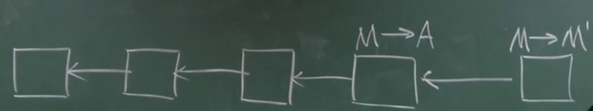

这个很显然，当诚实的节点查看到该区块后对其验证，能很明显地发现这是一个double spending，所以他们不会接收这个区块。

所以要想实现double spending，则必须重新开辟一个链，进而实现想要的效果，也就是第二种情况，如下图。

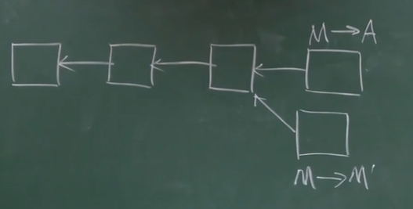

M想要发布一个M->M'的区块，然后和之前的M->A区块并列指向前面的同一个区块(因为在验证区块是只能沿着一条链进行验证，上面的链和下面的链只能验证一个，所以可以伪造一个含有非法交易的区块)。

**问**：那么这种攻击看起来也没什么用啊？因为两个链会进行最长合法链竞争，也就是一定会有一个区块变成orphan block，那样不就没有意义了嘛？

答：所以这种攻击的目的在于，如果M->A的交易产生了某种不可逆的外部效果，然后M->M'再把M->A的交易回滚，M就可以从中牟利。例如：在一个支持比特币交易的电商网站中，M买到了一些商品并成功使用比特币完成了交易，网站接收到结果后认为M支付成功了，便给M发送商品，M在接收到商品后又重新伪造一个包含回滚交易的区块，并把这个链拓展成为最长合法链。这样造成的结果就是：M白嫖了商品，网站血亏。

> 注：在上述例子中，恶意节点M想要发布区块M->M时，它只能连在M->A区块的前一个区块，这是在挖矿时就已经确定的，因此设置的block header里面就要填上前一个block header的哈希。这是一开始就要认定的，而不是获取记账权后再认定。

**问**：既然有可能发生这种攻击，那么该如何进行防范呢？

答：既然刚刚发生的攻击是建立在“过早确认”的情况下，那么可以针对这个方面进行改进。对上面的例子中，我们可以在M->A区块后追加几个合法的区块后再对其进行确认，此时再想伪造一个新区块并扩展为最长合法链是相当困难的。

在M->A交易刚写在区块里时，我们把它称为one confirmation，后面加的区块一次叫two confirmatin、three confirmation...在比特币系统中，缺省的设置是需要等待6个confirmation，有了6个confirmation便可认定M->A的交易是不可篡改的。(在这种情况下篡改难度是十分困难的，因为系统平均出块时间是10min，6个就是一个小时。。。)

> 补充：还有一种确认方式叫做零确认，即转账交易已经发布出去但并未写入区块链中，就像M->A交易已经发布但M->M'的区块还未挖掘出来。
>
> 在现实生活中，如一个电商正在委托一个全节点来监听区块链上的交易信息，在它收到转账交易后来验证交易的合法性，但并不将其写入到区块链中。
>
> 这样做有两个原因：
>
> ①比特币协议中缺省的设置是节点接收最先听到的交易，所以在零确认下节点收到M->A的交易后再接收到M->M'的交易，有大概率是不会接收的。
>
> ②对于电商网站来说，从交易成功到发货期间有一个很长的时间间隔，在这个长时间间隔中可以处理一些事情。

除了上述两种恶意行为之外还会不会有其他的恶意行为？

由于比特币协议中并没有规定获得记账权的节点必须将所有交易都打包到区块中，所以它可以选择故意不写入某些交易。但这种攻击用处不大，因为总有诚实的节点将交易写入区块中。

其实在比特币实际运作下，也会出现合法交易无法写入区块中的情况。因为在比特币协议中规定了每个区块大小的限制，最大不超过一兆字节。所以当一段时间内交易数目太大时，就会可能出现这种情况，当前合法的未写入区块的交易就会延伸到下一个区块再发布。

**假设三**：M->M'的链条虽然短，但它有没有可能先偷偷挖更多的区块但不发布，等上面的链条发布后再将自己的链条发布出去，进而达到forking attack的效果？

答：答案是肯定的。正常情况下都是挖到区块马上发布，因为被抢先发布的话出块奖励就没了，这种偷偷不发布攒区块的攻击叫做selfish mining。

但其实这种攻击成功的可能性不大，除非攻击者的算力非常强，比如超过总算力的51%。

不过selfish mining还存在其第二个目的：假如A此时已经挖了两个区块并且没有发布，在B挖完一个区块并且发布后将自己的两个区块发布出去，这样B挖的区块就作废了。这样做的好处在于当其他节点都在花大量算力挖第一个区块时，A已经在挖第二个区块了，减少了竞争(前提在于A的算力足够强)。

但这样做也有风险，比较容易想到，可以思考一下，不再展开叙述。
