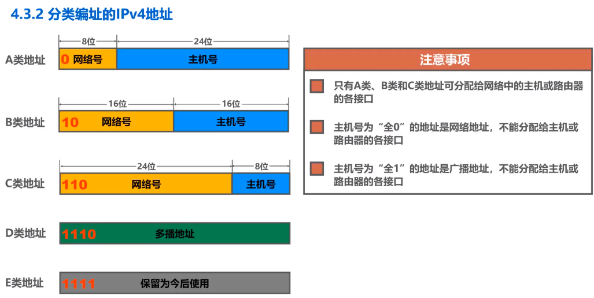
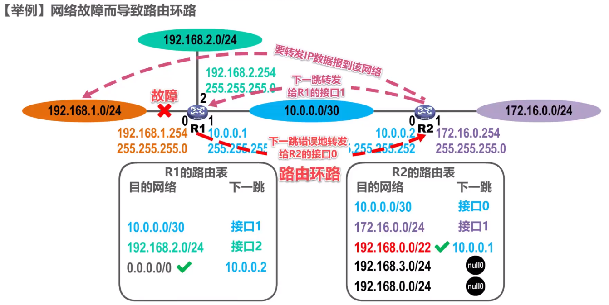
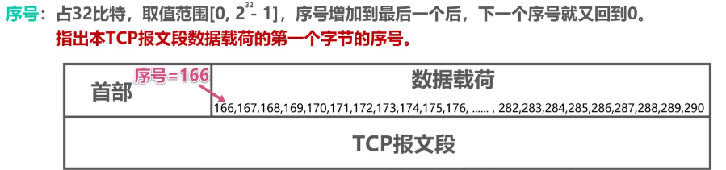
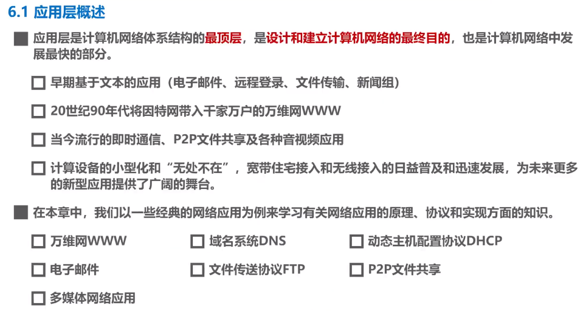
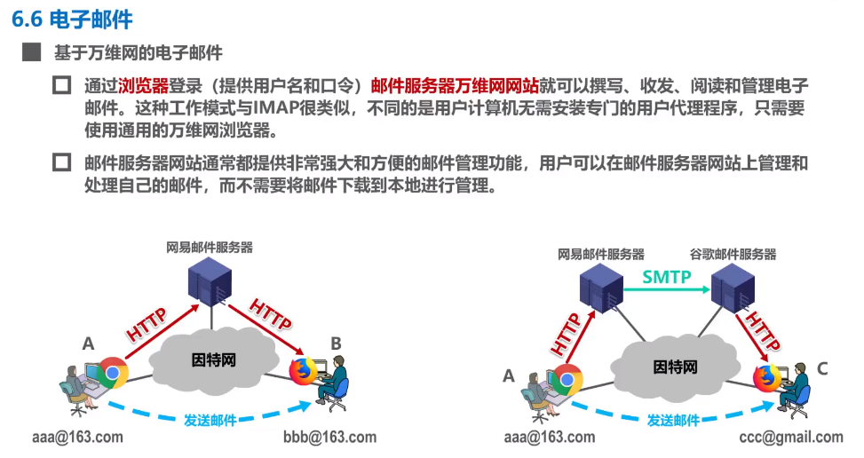

# 计算机网络

## 1. 计算机网络概述

## 2. 物理层

## 3. 数据链路层

## 4.网络层

### 4.1 网络层概述

- **网络层概述：**
- **总结：**

### 4.2 网络层提供的两种服务

- **面向连接的虚电路服务：**

- **无连接的数据包服务：**

- **总结：**

### 4.3 IPv4

#### 4.3.1 IPv4概述

- **概述：**

- **IPv4的表示方法（点分十进制）：**

#### 4.3.2 分类编址的IPv4地址

- **分类编址后的IPv4类型：**

​	从上面可以看出在分类编址中IPv4被分为了五类地址，下面对着五类地址进行详细解析。

- **A类地址：**

​	A类地址最特殊的就是其中有两个网络号不可以指派：0/127。

- **B类地址：**

- **C类地址：**

- **Exercise：**

#### 4.3.3 划分子网的IPv4地址

- **提出划分子网的原因：**

  ​	因为基于分类编址的IPv4地址在分配时需要根据其网络号，如果一个公司中又有多个子网，那么就需要为其他子网新增网络号，带来资源的浪费，由此产生了划分子网的IPv4地址，也就是可以通过子网掩码向主机号部分“借”网络号来使用。

- **子网掩码：**

- **对划分子网的IPv4进行举例：**

- **Exercise：**

- **默认子网掩码：**

​		其实就是在分类编址的基础上对IPv4的地址进行了子网掩码的转换。

- **总结：**

#### 4.3.4 无分类编址的IPv4地址

- **无分类编址：**

- **CIDR：**

- **CIDR举例：**

- **路由聚合：**

​		所谓路由聚合就是将几个路由表中的IP地址聚合在一起，满足其最长前缀匹配即可得到。

- **IPv4 Example：**

> 本题很容易想当然的将能收到IP分组的主机数量表示为：总主机数 - 2。但其实本题属于一个巧合，目的地址为192.168.4.3的地址刚好是题头子网中的广播地址，所以可接受到IP分组的主机刚好给题头子网中的合法主机，即4 - 2 = 2。但如果更改题目条件使得目的地址为子网下其中一个主机的IP地址，那么其最大主机数一定始终为1。

- **路由聚合Example：**

- **总结：**

#### 4.3.5 IPv4地址的应用规划

- **两种子网掩码：**

- **定长的子网掩码：**

​		根据定长的子网掩码的定义，我们只能对不同的子网设置相同的子网掩码，这就要求我们需要找到子网中需要IP地址的最大值的那一组，进而定义其子网掩码。但其有一个严重的**缺点**：IP地址会出现浪费情况，因为定长的子网掩码的设计总是根据最大值而设计的，当一个子网中需要的IP数比较少时就会造成浪费。所以提出了变长的子网掩码。

- **变长的子网掩码：**

​	由于例子与定长的子网掩码的例子相同，在变长的子网掩码中我们仅需要对不同的地址块进行分配，下面就是**地址块的分配原则：**

根据原则，例子的分配应如下：

- **总结：**

### 4.4 IP数据报的发送和转发过程

- **举例：**

​	路由器转发数据报文是会将其目的地址于路由器中路由表的子网掩码相与，然后将得到的网络号与路由表中的进行对比，相同则转发，不同则丢弃。

​	

​	之前路由器转发的都是单播的数据报文，如果路由器收到一个广播报文，那么它是不会选择转发的。因为在庞大的互联网中如果路由器对广播报文进行转发的话，那么互联网中的主机将会收到无数个广播报文，所以不会对其转发。

- **Exercise：**

### 4.5 静态路由的配置及其路由环路问题

- **静态路由概述：**

- **静态路由配置举例：**

​	上图是网络中R1和R2的初始状态。

​	路由器R1向R2转发IP数据包时配置静态路由。R2向R1转发也类似。

- **默认路由配置：**

​	默认路由会在目的地址为多个的时候选择配置。

- **特定主机路由：**

​	特定主机路由一般会在网络测试或者为了一些安全性问题考虑时会用到。其配置方法见上图。在配置之后，路由器会根据最长前缀匹配原则进行转发。

- **静态路由配置错误导致的路由环路问题：**

上图为初始正常状态下的路由配置信息。

上图时错误配置静态路由后的路由配置信息。

上图为其配置错误所导致的结果——路由环路。（其过程可以在默默过一遍）

- **聚合了不存在的网络导致的路由环路问题：**

​	上图为初始状态。

上图为转发IP数据分组到了聚合网络下不存在的网络中，导致了路由环路问题。

​	为了解决上述问题，引出了黑洞路由的概念。一旦IP数据由路由器转发到了黑洞路由中，那么就会直接丢弃。

- **网络故障而导致路由环路：**

​	与路由器相连的网络发生故障，路由器的路由表中自动将与其相关的记录删除，然后受到与其相关的IP数据报后就会出现套娃操作。

​	为了解决此问题，路由器会在路由表中添加一个与故障网络有关的黑洞路由，即解决了环路问题。一旦网络故障得到了恢复，路由器会将路由表中的黑洞路由设置为失效状态，并将之前删除的路由条目加进去，以恢复正常工作，直至下一次出现故障。

- **总结：**

### 4.6路由选择协议

#### 4.6.1 路由选择协议概述

- **静态/动态路由选择：**

- **因特网选用的路由选择协议的主要特点：**

- **因特网采用分层次的路由选择协议：**

- **常见的路由选择协议：**

- **路由器的基本结构：**

- **总结：**

#### 4.6.2 RIP

- **RIP的基本工作原理：**

- **举例说明RIP基本工作过程：**

- **RIP路由条目的更新规则：**

初始状态，路由器C向路由器D发送自己的路由表。

在路由器D收到来自路由器C的路由表后对其进行改造，即将其下一跳全部改为C并且将距离加一（理解为路由器D可以通过路由器C来转发报文，所以下一跳全为C且举例加一）。

路由器D根据改造后的路由表和自己的路由表进行对比：

①如果相同下一跳但距离变化了（无论变大还是变小），则代表网络拓扑结构变化了，需要更新；

②发现新的网络则添加；

③到达目的网络距离变小了，更新。

④到达目的网络距离没变但下一跳变了，添加使其等价负载均衡。

- **Exercise：**

答案见下图

> 注：时刻记住在RIP协议中当距离为16时表示目的网络不可达！！！

- **坏消息传得慢：**

​	假设路由器R1到网络N1之间出现了故障，此时R1会将路由表中与N1的距离更改为16以表示不可达。但如果此时R2的更新周期提前于R1的发送，也就是R2发送的路由表先到达R1，R1发送到R2的路由表后到达。此时R1就会被R2发来的“谣言”而误导，从而错误地认为自己到N1的距离为3。

​	由于已经出现了“误导”现象，所以在R1的RIP更新周期到了之后它又会向R2发送路由表，R2收到后也会继续这么做，从而产生一个长达数分钟的路由环路。这就是“坏消息传得慢”问题。

- **坏消息传得慢的解决方法：**

- **Exercise：**

==这题有疑惑。==

- **总结：**

## 5.传输层

### 5.1 运输层概述

### 5.2 运输层端口号、复用、分用概念

- **端口号：****端口号**用来区分应用层不同应用进程。其中应该了解熟知端口号的范围。

- **复用、分用：**

- 应用层常用协议所使用的熟知端口号：

### 5.3 UDP和TCP的对比

- 

- *[具体区别](https://www.bilibili.com/video/BV1c4411d7jb?p=59)*

### 5.4 TCP的流量控制

- 	TCP中流量控制发生在接受方控制发送方流量。所谓流量控制就是让发送放的发送速率不要太快，要让接受方来得及接收。

- 实现TCP的流量控制是建立在滑动窗口机制上的，下面举一个[例子](https://www.bilibili.com/video/BV1c4411d7jb?p=60)

  > TCP的流量控制是基于滑动窗口机制的，其中滑动窗口机制采用的是累计确认。

### 5.5 TCP的拥塞控制

- 

- 对于TCP的拥塞控制，主要有四种拥塞控制算法：慢开始、拥塞避免、快重传、快恢复。

  - 首先需要声明几个重要的变量：拥塞窗口cwnd、慢开始门限ssthresh、发送窗口swnd

  

  - 上图即各变量的基本用法。[例子](https://www.bilibili.com/video/BV1c4411d7jb?p=61)中说明了慢开始和拥塞控制的基本原理，但由于互联网中可能有时会有个别保温段丢失，但实际上网络此时并未发生拥塞，此时如果触发超时重传那么将会误认为网络发生了拥塞，会使得传输效率降低，为了改善这种情况则提出了快重传算法。

  - 快重传算法就是在超时重传器结束之前完成丢失报文的重传，其原理见视频。

  - 快恢复算法就是在出现快重传之后对ssthresh进行减半处理并将cwnd=ssthresh罢了。

- ***总结如上图***

### 5.6 TCP超时重传时间的选择

-  TCP中超时重传时间RTO的选择比较复杂，因为RTO必须保证其略大于RTT（小于会导致不必要的重传，太大导致传输效率低）。然后RTT的值不是恒定不变的，所以RTO的选取比较复杂。

- 

  上图为RTO的计算公式。它是没有发生超时重传的计算方式，发生了后会：

  

  [例子在视频后部分](https://www.bilibili.com/video/BV1c4411d7jb?p=62)

### 5.7 TCP可靠传输的实现

- TCP可靠传输的实现靠滑动窗口机制，它是以字节为单位进行传输确认。其中的过程[见视频](https://www.bilibili.com/video/BV1c4411d7jb?p=63)。

- 

  ​	由于TCP需要对数据进行按序交付给上层处理，这就导致接受方必须将接受到的数据按序接受，但发送来的数据不一定是按序到达的，那么TCP的做法就是对不按序到达的数据临时存放在接受窗口中 ，等到字节流中所缺少的字节收到后再按序交付给上层处理。

### 5.8 TCP的三次握手

- 

  ​	TCP三次握手建立连接的过程如上图。其中的SYN代表同步位，表示三报文握手的建立，在SYN=1时，报文不能发送数据；seq表示序号；ACK表示标志位，在TCP建立连接后所有的报文段中的ACK均为1；ack表示确认号，表明对上一个TCP报文的确认，值通常为上一个seq+1。

  > 观察上图可发现第三次握手中SYN不为1，这说明第三次握手时客户端可以向服务器发送数据报文，其seq=x+1。如果此报文不携带数据，则其不消耗序号，即下一次发送数据报文是seq依旧为x+1。

- **思考：为什么TCP握手是三次而不是两次或者四次？**

  答案可以在知乎找到。

- **总结：**

### 5.9 TCP四次挥手

- 

  

  ​	TCP四次挥手的过程如上图所示，其中第一次挥手的seq表明客户端最后一次发送数据的序号+1，ack表示客户端最后一次收到数据的序号+1。其他的过程与三次握手类似，不再赘述。

- **思考：为什么TCP第四次握手后还需要等待2MSL才算结束呢？**

  答案在[视频](https://www.bilibili.com/video/BV1c4411d7jb?p=65)中。

- 

  如果TCP客户进程发生了故障，为了节省服务器的资源，则必须要有一定的措施，见上图。

### 5.10 TCP报文段的首部格式

- 

- 

  

## 6. 应用层

### 6.1 应用层概述

### 6.2 C/S方式和P2P方式

### 6.3 DHCP协议

- 

	​	在一个庞大的互联网中，手动的给每个计算机配置相关的IP地址、掩码、网关等是不现实的，为了解决这一问题，我们引入了DHCP。

- **DHCP的工作过程：**

  

    [DHCP详细过程](https://www.bilibili.com/video/BV1c4411d7jb?p=69)

- **DHCP中继代理：**

  ​	上图中提到在一个交换机下的主机可不可以自动获取到IP地址等网络配置信息。答案是否定的。因为在主机发送DISCOVER报文时需要发送广播，但路由器不会转发广播报文，所以不能自动获取。如想自动获取则需要给对应的路由器配置DHCP服务器的IP地址并使之成为DHCP中继代理。

  > DHCP中继代理是很常见的，因为不可能在每一个网络上都设置一个DHCP服务器，这样会使得DHCP服务器的数量太多。

### 6.4 DNS

- 

- **域名服务器的四种类型：**

- **域名查询方法：**

- **DNS高速缓存：**

### 6.5 FTP

- **FTP的基本工作原理：**

  

​	上面两个图分别代表FTP的主动模式和被动模式。主动模式与被动模式不同的是：在传送数据的通路中，主动模式的客户与服务端的20端口建立连接，被动模式的则是客户与服务端的随机选择的端口建立连接。

### 6.6 电子邮件SMTP

- **电子邮件：**

- **电子邮件的发送过程：**

​	由上图可以看出，发送方通过用户代理使用SMTP将邮件发送给发送方的邮件服务器，在发送方邮件服务器中SMTP客户使用SMTP将邮件发送给接收方的SMTP邮件服务器。至此，发送电子邮件只使用了SMTP协议。对于接收方，其与接收方的邮件服务器不可再使用SMTP协议，而是使用POP3协议或者其他接收协议。

- **SMTP的具体过程：**

​	SMTP的具体过程作为了解即可，具体过程在[链接](https://www.bilibili.com/video/BV1c4411d7jb?p=72)。

- **电子邮件的格式：**

- **MIME：**

​	由于SMTP只允许传送ASCII码文本数据，对于其他的不能满足ASCII的文本数据不能传送，为了提高其扩展性提出了MIME，它可以在发送方发送数据前对其文本数据进行处理，使其文本数据变成ASCII码数据再使用SMTP进行发送。同理，接收方只不过时发送方的逆过程罢了。如下图所示：

- **POP/IMAP：**

- **基于万维网的电子邮件：**

​		由上图可以比较在同一邮件服务器下的两台主机和在不同邮件服务器下的两台主机的通信。相同的即收发双方均使用HTTP协议，不同的则在收发双方使用HTTP，收发的邮件服务器之间使用SMTP。

### 6.7 万维网WWW

- **万维网的一次访问：**

- **URL：**

- **万维网的文档：**

  ​	就是前端三件套。

- **HTTP：**

- **HTTP/1.0：**

​		HTTP/1.0采用的时非持续连接的方式，即每次请求文件都需要建立一次TCP连接，时间开销比较大。

- **HTTP/1.1：**

​		HTTP/1.1不同于HTTP/1.0，其采用了持续连接的方式，也就是说在第一次连接建立完成后不会断开连接，只要以后所请求的文件在同一个服务器上就不需要再重新建立连接。另外，它先进于1.0的还有其流水线工作方式，也就是说它可以一下发送许多个请求报文，服务器只需要接收报文后一个一个的相应报文即可，大大节省了时间！

- **HTTP的请求报文格式：**

> 如果Connection后面时keep-alive那就表示是持续连接。

- **HTTP请求报文中的方法：**

- **HTTP响应报文格式：**

- **HTTP相应报文中的状态码：**

- **Cookie：**

- **Cookie过程：**

- **万维网Cache和代理服务器：**

> 代理服务器用来减少路由器之间端到端的传播时延。其过程见[视频](https://www.bilibili.com/video/BV1c4411d7jb?p=73)，不再赘述。