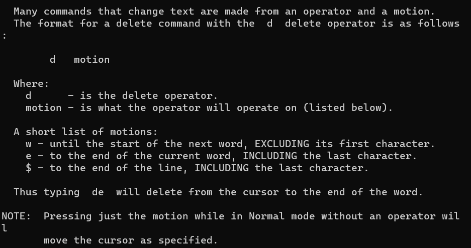
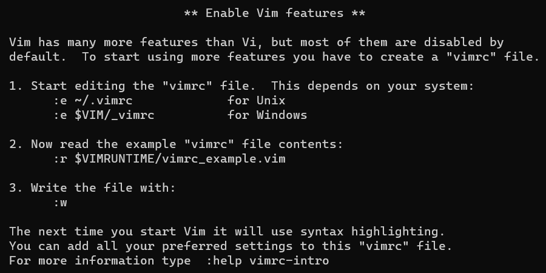

# 跟着Vimtutor学习Vim

## Lesson 1

### 1.1 移动光标

- 在Vim中移动光标，分别使用h、j、k、l键代表左、下、上、右方向。

### 1.2 退出VIM

```vim
:q! <ENTER>			退出Vim（丢弃内容）
```

上述命令可以退出VIM。

> 注：必须在Normal mode下使用。（可以按下<ESC>键来确保进入了Normal mode）

### 1.3 文本编辑 - 删除

在Normal mode中，可以键入

```vim
x					删除光标指定字符
```

来删除单个字符。

### 1.4 文本编辑 - 插入

在Normal mode中，键入

```vim
i					插入文本到光标指定行
```

可以在指定位置插入文本，完成后键入<ESC>即可回到nm中。

### 1.5 文本编辑 - APPENDING

在nm中，键入

```vim
A					追加文本到光标指定行
```

可以实现在选定的一行中的末尾进行追加（插入）文本操作。

> 注意是大写的A。

### 1.6 编辑一个文件

使用VIM创建/打开一个文件, filename为定义的文件名

```vim
vim filename <ENTER>		打开/创建文件
```

使用VIM保存一个文件，在编辑完成后进入nm，然后键入：

```vim
:wq <ENTER>					保存文件
```

## Lesson 2

### 2.1 删除命令

进入nm，输入下面命令即可删除一个单词(word)（包括空格）

```vim
dw					删除光标后对应的单词
```

### 2.2 更多的删除命令

进入nm，下面命令可以删除光标后的指定行的文本

```vim
d$					删除光标后指定行的文本
```

### 2.3 对于运算符及有关操作

在VIM中，许多命令都是一个operator加上一些motion完成的，如：



可以看出对于删除操作而言，d后面跟不同的motions会有不同的操作效果。其中：

w - 下一个词的词首，但不包括第一个首字母。

e - 当前词的词尾，包括最后一个字母。

$ - 最后一行，包括最后一个字母。

### 2.4 在Motion中用数字

对于motion可以插入数字，进而产生不同的效果。

```vim
2w					将光标向前移动两个词
3e					将光标向前移动三个词直到第三个词的末尾
0					将光标移动到指定行的头部
```

### 2.5 在删除中使用数字

通常的形式为:

```vim
d	number	motion
```

例如对于 **d2w** 其意义就是删除光标后的两个单词。

### 2.6 文本行上的操作

输入下面命令可以删除整行文本

```vim
dd					删除整行文本
```

当然也可以删除多行，只需要指明删除的行数即可。如2dd就代表删除光标所指的行及下一个，共两行。

### 2.7 撤回操作

在VIM中，**u**可以实现撤回上次的操作，**U**可以实现撤回整行修改的操作。

```vim
u					撤回上次操作
U					撤回整行的修改操作
CTRL-U				撤回“撤回的消息”
```

## Lesson 3

### 3.1 Put操作

​	在VIM中，使用**dd**命令可以实现删除光标指定行的功能，但其所做的事情并不只是简单的将指定行删除，它在删除了行内容之后还将其放入了一个Vim寄存器中，因此我们可以使用如下命令将内容再Put（粘贴）到指定位置。

```vim
p					Put命令，相当于粘贴功能
```

### 3.2 Replace操作

rx操作实现更改指定的单个字符为x。

```vim
rx		r代表replace，x代表替换字符（同来替换光标指定字符）
```

### 3.3 更改操作

ce操作可以实现更改一个单词指定位置之后的所有字符。

```vim
ce			光标指定单词的位置，ce可以更改光标后所有字符
```

### 3.4 关于更改的更多操作

相比于删除操作，更改操作和其使用方法差不多，如下：

```vim
c	[number]	motion
```

c代表更改操作，number代表要更改的数量，motion即相关motion。

如：对于d2w，就是更改光标指定后面的两个单词。

d$，就是更改光标指定后的文本（一行）。

## Lesson 4

### 4.1 光标位置和文件状态

```vim
CTRL-G				显示出文件位置和当前光标所在行
G					移动光标到文件底部位置
gg					移动光标到文件头部位置
[number] G			移动光标到指定行（number就是行数）
```

### 4.2 搜索命令

```vim
/	[target]		/代表搜索，target代表需要搜索的内容
```

​	对于搜索来说，/是以当前位置向后进行检索，如果找不到就再从头开始找；而?与其相反，是向前检索。

为了方便检索，Vim还提供了下面两个快捷方式：

```vim
n					按既定方向搜索指定内容
N					按既定方向的反方向搜索指定内容
```

另外，CTRL-O可以回到上次光标的行位置，CTRL-I与其相反。

### 4.3 括号匹配搜索

```
%					寻找匹配的圆括号/花括号/中括号等
```

### 4.4 Substitute替换命令

```vim
:s/old/new		<ENTER>		s命令将old替换为new
:s/old/new/g 	<ENTER>		全局替换
```

​	上面的命令代表在指定行中，将old的值替换为new，但只能替换第一次出现的old。如想替换指定行所有的old，则需要在最后加一个/g代表代换globally。

```vim
:#,#s/old/new/g			表示在#到#行之间的文本进行替换
:%s/old/new/g			表示全文进行替换
:%s/old/new/gc			表示全文进行替换，但每次替换有请求
```

## Lesson 5

### 5.1 在Vim中执行外部命令

```vim
:! [external-command]		在执行shell中的命令
```

例如：在Vim中键入 ***:!ls*** 可以实现得到当前目录的文件信息。

### 5.2 在Vim中写入文件

```vim
:w	FILENAME			将内容写入名为FILENAME的文件中
:!rm FILENAME			使用外部命令删除名为FILENAME的文件
```

### 5.3 选择文本写入

```vim
v motion :w FILENAME	使用v选择文本然后写入文件中
```

​	在Vim中使用v选择相应文本，选择完成后键入:，之后会出现一个'<,'>'的字符出现在底部，之后键入w FILENAME即可完成操作。

### 5.4 检索并合并文件

```vim
:r FILENAME		将FILENAME文件内容读取并插入到光标所在位置后
```

​	此外， ***:r*** 还可以实现读取控制台的输出内容。如：

​	***:r !ls*** 可以实现将当前路径下的文本信息（ls后的内容）插入到光标所在位置之后。

## Lesson 6

### 6.1 Open命令

```vim
o				o命令可以在光标指定行下创建新的一行
O				O命令可以在光标指定行上创建新的一行
```

> 这两个命令其不同之处仅仅在于方向，相同之处在于都相当于另开一行，属于插入操作。

### 6.2 Append命令

```vim
a				a命令指定在光标所在位置插入文本
```

​	与之前的 ***A*** 命令相似的是这两个都是相同的插入模式，只是插入的位置不同罢了。

### 6.3 Replace的不同方式

```VIM
R				R命令可以替换光标后面的内容
```

​	与之前的 ***r*** 命令相似的是两者都是对文本进行替换，不过 ***r*** 是对字符进行替换，此命令是替换任意字符。

> 注：Replace mode is like Insert mode, but every typed character deletes an existing character.

### 6.4 复制和粘贴

```vim
y				y命令可以复制选定的文本
p				p命令可以粘贴选定的文本
```

​	如果想要实现粘贴文本，则需要先使用 ***v*** 命令选定文本，之后使用y命令复制文本，再将光标移动到指定位置，使用 ***p*** 命令粘贴文本即可。

### 6.5 设置选项

```vim
:set ic			设置在搜索/替换时忽略大小写(Ignore case)
:set hls is		设置搜索时高亮显示
:set noic		设置不忽略大小写
-------------------------------------------------------
:nohlsearch		去除高亮显示
/[target] \c <ENTER>	\c可以实现尽在本次搜索时忽略大小写	
```

## Lesson 7

### 7.1 Getting Help

```vim
Press the <F1> key			按下F1键
:help <ENTER>				输入help指令
```

以上两种方法可以实现弹出帮助。

```vim
CTRL-W						切换窗口
:q <ENTER>					退出指令
```

### 7.2 创建启动脚本

可以编辑Vim的一些特征。如下图



### 7.3 补全

```vim
CTRL-D				未输全命令时展示其所有形式
<TAB>				自动补全
```

