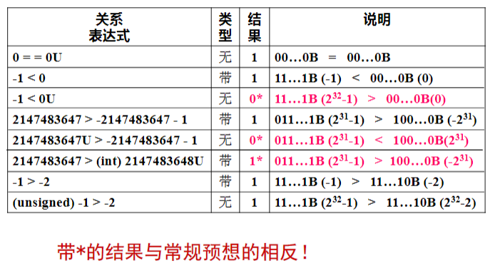
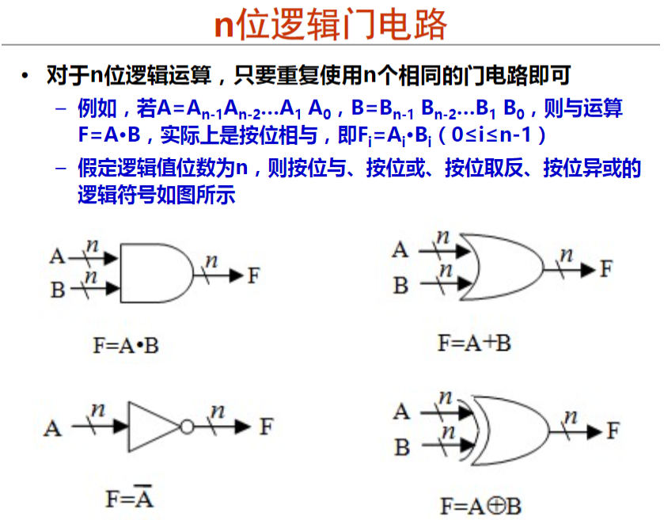
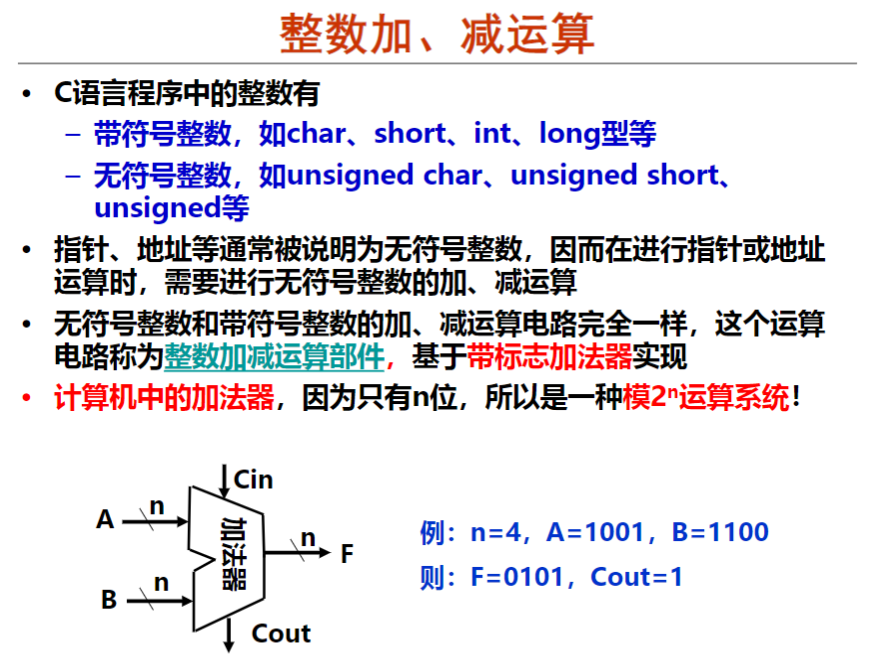

# 计算机系统基础

## 1. 计算机系统概述

待补充...

-----


## 2. 数据的表示和存储

### 2.1. 数制和编码

- 一般来说，数据有多种不同的表示形式。在计算机内部所有的信息都是用二进制来进行编码，但二进制编码的表示太过于麻烦和冗余，所以我们大多数时候使用十六进制编码来代替二进制编码。
- 对于不同进制的数据，其表示形式其实大抵相同。都有自己的基数以及权值。在R进制中，其运算原则就是“逢R进一”。

### 2.2 定点数的编码表示

- 原码：最高位作为符号位，其余位表示真值的绝对值。

- 反码、补码：略。

- ==移码（待补充）==：把补码的符号位取反，通常用浮点数数值的二进制表示中。

- **补码的定义**：对于X，假定补码有n位，则：[X]~补~ = 2^n^ + X (-2^n^ <= X < 2^n^， mod 2^n^)。

  

- 

- 根据上述给定的补码的定义，看下面的例题：

  所以正数的补码就是其本身，负数的补码相当于其对应的正数补码**各位取反、末位加一**。

- 另外，如何求补码的真值呢？有以下定义：

  相当于最高位字符取反，其余各位取正然后相加即可。

### 2.3 C语言中的整数

- C语言支持的数据类型

- 由上图可知整数类型分为无符号整数和带符号整数。

- 对于无符号整数来说，其整数编码中不存在符号位，通常用来表示正数运算，例如地址运算、编号等等；

- 有符号整数不同于无符号整数，其有响应的表示正负的符号位，通常有三种定点编码表示：原码/移码/补码。

- 对于C语言中同时处理带符号整数和无符号整数，C编译器会把带符号整数强制转换为无符号整数，这也就牵扯到了两种数制中的比较，如图所示：通过观察上图所示结果，可以发现其结果与常规有一点差异。由于在比较两种整数时C编译器会把带符号整数强制转化为无符号整数，所以在比较时需要先把带符号整数的补码形式表示出来，然后将其转换为无符号形式，再比较大小。（另外，如果无符号整数被强制转换成为了带符号整数，例如上图中倒数第三行，则需要比较两者带符号形式的大小）

- 编译器中有C90和C99两种标准，两种标准如下：

  Ex：

  

  将上述结论写入C代码中进行测试并在C90上进行运算，可以发现结果为：

  

  

```c
#include<stdio.h>

int main(int argc, char const *argv[])
{
    int x = -1;
    unsigned u = 2147483648;

    printf("x = %u = %d\n", x, x);
    printf("u = %u = %d\n", u, u);

    if (-2147483648 < 2147483647) 
    {
        printf("-2147483648 < 2147483647 is true\n");
    }
    else
    {
        printf("-2147483648 < 2147483647 is false\n");
    }

    if (-2147483648 - 1 < 2147483647)
    {
        printf("2147483648 - 1 < 2147483647\n");
    }
    else if (-2147483648 - 1 == 2147483647)
    {
        printf("2147483648 - 1 = 2147483647\n");
    }
    else
    {
        printf("2147483648 - 1 > 2147483647\n");
    }

    return 0;
}
```

但是在C99上运行结果则为：


这是因为在C99中他们全部变成了有符号数字，所以在比较时就与常规一样，比较符合常识。

### 2.4 浮点数的编码表示

- IEEE 754标准中规格化数的表示：

  由上图可以得知，IEEE 754标准规定了对于单精度的浮点数，其有1位S表示正负，8位阶码和23位的尾数。其实阶码就是移码，但此时的阶码与之前定义的移码并不相同（参见2.2）。对于IEEE 754中，单精度浮点数阶码的偏移值为127，那么为什么不使用128呢？详见[为什么用移码来表示阶码](https://www.cnblogs.com/roscangjie/p/12237725.html)。

- Ex：

  

- IEEE 754中特殊数的表示：

  

  

  

  

### 2.5 非数值数据的编码

- > [PPT](https://www.icourse163.org/learn/NJU-1001625001?tid=1460891441#/learn/content?type=detail&id=1237325735&cid=1257246662)

### 2.6 数据宽度和存储容量的单位

- 

- ***“字”与“字长”概念不相同！*** “字”指被处理信息的单位，用来度量数据类型的宽度。“字长”一般指数据通路的宽度，它等于CPU内部总线的宽度、GR的宽度。

- 

  > **注：容量中的K与带宽中的k不一样，一个表示2^10^，一个表示10^3^。对于如何区分它们，只需要具体情况具体分析。**

- 

  > 对于不同字长的机器，其数据类型的长度可能会有所不同。

### 2.7 数据存储时的字节排列

- 80年代后，几乎所有计算机都采用字节编址。对于不同的数据类型，其占用的存储单元也可能不同，考虑一个问题：变量地址是其最大地址还是最小地址？多个字节在存储单元中存放的顺序如何？

- 数据的排列顺序一般有两种：大端方式和小端方式。其中大端方式就是MSB在地址首部，LSB在地址尾部；小端方式则与其相反。Ex：

  

  -----

## 3. 运算电路基础

### 3.1 数字逻辑电路基础

- **布尔代数：**0和1表示假和真，有基本的逻辑运算（与或非）。

- **一位逻辑门电路：**根据上面所定义的布尔代数，我们可以通过其逻辑表达式来画出其基本门电路。其中有三种基本门电路：与门、或门、非门。其他的门电路可以由这三种基本门电路组合形成（如异或门电路）。

- **n位逻辑门电路：**跟一位逻辑门电路类似，只不过是位数是n罢了。

- 根据逻辑电路是否有存储功能，可以将逻辑电路分为两类：

  **组合逻辑电路：**没有存储功能，其输出仅依赖于当前输入。

  **时序逻辑电路：**具有存储功能，其输出不仅依赖于当前输入，还依赖于存储单元的当前状态。

- **多路选择器(MUX)：**最简单和最常用的多路选择器就是**二路选择器**，它有两个输入端A、B、一个控制端S和一个输出端F，功能随着S的不同而不同（见上图）。而K路选择器与二路选择器其实也类似，只不过它有K个输入，控制端S的位数是log~2~K。

- **一位加法器（全加器）：**

  从上图中可以看出一位加法器的结构及其真值表，可以发现只要A、B、Cin中有两个或两个以上1，那么其高位进位Cout就为1，而当A、B、Cin中有奇数个1时，F才为1。

  > 一位加法器只能对两个无符号整数进行相加

- **n位加法器：**

  n位加法器其实就是n个一位加法器通过以高位进位Cout相连而成的，相比于一位加法器，它有2个n位数，在进行加法运算时各位相加，其运算规则与一位加法器相同。

  > n位加法器只能对无符号整数进行相加。

- **n位带标志加法器：**

  相比于n位加法器，n位带标志加法器可以实现对带符号整数的相加，并且可以判断溢出。为了实现功能，它比n位加法器多了几个带标志的输出端（OF/SF/ZF/CF）。

- 由于计算机中的数字都是以补码的形式进行表示，那么为了实现对带符号的整数进行运算，在已知[x]~补~和[y]~补~的情况下需要计算[x+y]~补~和[x-y]~补~。那么根据定义对其进行推导可得：

- **n位整数加/减运算器：**

  对于加法求解没有什么可追究的，主要是如何计算负数的补码实现减法运算。通过上图的逻辑电路可以看出当Sub取不同值时运算器可以实现不同的运算。对于减法，Sub取0，此时B端取反加一（与Cin相加），然后与A端运算从而实现减法。

- **算术逻辑单元（ALU）:**

  ALU可以实现整数的加减以及简单的逻辑运算，它其实就相当于上面所提到的n位整数加/减运算器，其中ALUop就相当于n位整数加/减运算器的Sub端（控制端），根据ALU中有多少种操作类型进行决定k的数值为多大。

- **ALU在计算机中的体现：**

  从图中可以看出，与控制器相连的红色虚线代表了ALU的控制段，MDR中的两个数据单元作为了ALU的运算对象，其结果可以输出到MDR中作为存储单元进行存储。

### 3.2 C表达式与逻辑电路

- 从C表达式到逻辑电路之间有这么一个过程：C语言转化为指令，指令控制逻辑电路进行运算。详见[PPT](https://www.icourse163.org/learn/NJU-1001625001?tid=1460891441#/learn/content?type=detail&id=1237325740&cid=1257246672)

### 3.3 C语言中的各类运算

- C语言中有**算数运算、按位运算、移位运算**。

  > 移位运算对无符号数和带符号整数的计算方式有所差异，注意区分！

- **逻辑运算：**

  > &和&&的含义不同，注意区分！

- **位扩展和位截断：**

  > 注意在扩展和截断过程中数字的变化，有可能出现溢出现象。

  [位扩展和位截断的PPT例子(P~8~-P~9~)](https://www.icourse163.org/learn/NJU-1001625001?tid=1460891441#/learn/content?type=detail&id=1237325741&cid=1257246674)

### 3.4 整数加减运算

- **整数加减运算：**

- **运算电路核心：**

  计算机底层并不知道运算的数字是带符号数和无符号数，它们在底层不过是一串0、1序列罢了。

- **n位整数加/减运算器的标志位：**

  > 条件标志含有四个：ZF、OF、CF、SF，下面来看一下他们在电路中是如何表示的。

  

  由上图可以得到四个标志的逻辑表达式。其中OF的结果为最高进位数与次高进位数进行异或操作，表示结果是否出现溢出；SF结果为加法器输出结果的最高位，相当于符号位；ZF的结果是结果中所有位均为0才为1，表示结果是否为0；CF的结果是最高位进位与最低位进位Cin异或，表示结果是否进位或者借位。（**它们的计算很重要，需要理解记忆！**）

- **整数加法/减法举例：**

  >***整数加法规则：***
  >
  >==无符号加溢出条件：CF=1==
  >
  >==带符号加溢出条件：OF=1==

  对于上述计算条件，若将两数当做**无符号整数**，那么考虑其进位标志CF，其Cout=0，由于是加法运算，那么Sub=0，即Cin也为0，故CF=0，即结果不会出现溢出，正确！

  若将两数当做**带符号整数**，两数不变均为正，而结果为负数，可以说明发生了溢出，但从逻辑的角度来看我们需要正木ing其CF=1才能说明它发生了溢出。由条件可以看出Cout=0，次高位为1，故CF=1，即结果发生了溢出，错误！

  

  >***整数减法规则：***
  >
  >由于之前已经证明过补码的减法就相当于前面一个补码加上后一个取反后补码的结果，所以整数减法规则与整数加法规则相同，还是根据是否带符号条件来看CF/OF。

  所以其分析可以参考上一题的分析，这里省略。

  **（注：这里的减法操作要求Sub=1，所以Cin也随之为1）**

- **加减溢出公式及其举例：**

  [举例PPT P9-P13](https://www.icourse163.org/learn/NJU-1001625001?tid=1460891441#/learn/content?type=detail&id=1237325742&cid=1257246677)

