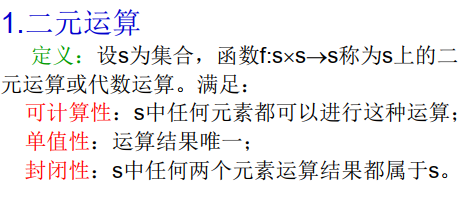
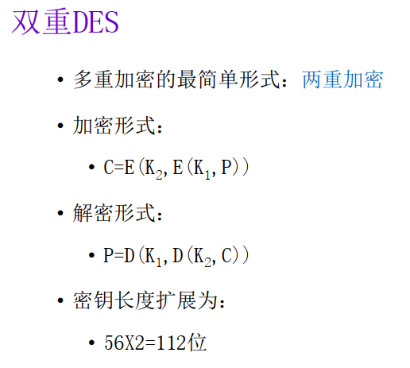
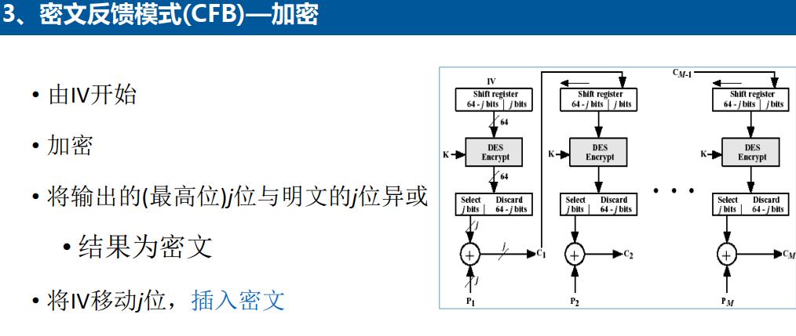
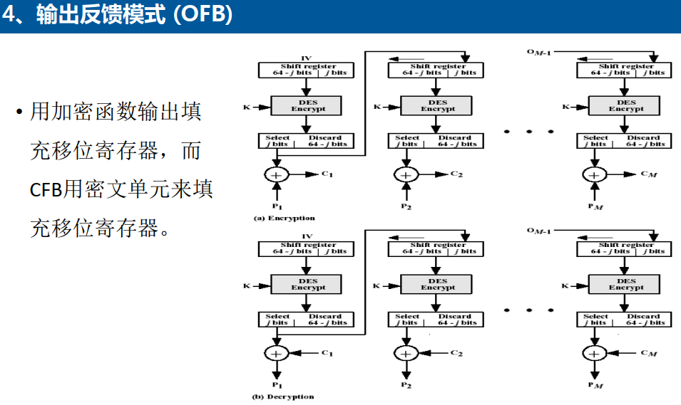

# 密码学回顾

## 传统加密技术

- **凯撒密码：**

由于凯撒密码很容易被找到规律，所以之后提出了Playfair和Hill，不再赘述。

- **密码加密技术：**

***置换：***

例子：

​	**代换**与**置换**不同，置换不更改所使用的字母，仅仅对其位置进行变换。而代换需要根据一个替换表来进行加密解密，具体如下：

-----

## 数论基础

### 整除

- **约简：**

> 注：任何整数模的约简都是非负数。

- **带余除法：**

- **辗转相除法：**

- **整数惟一分解定理：**

- **最小公倍数和最大公约数：**

  略。

- **互素：**

- **乘法逆元：**

- **乘法逆元的计算：**

**举例：**

### 同余与同余式

- **同余及其基本性质：**

- **剩余类和剩余系：**

  ==待学习==

- **欧拉函数：**

**欧拉函数的计算方法：**

> 对于n能够分解为两个素数，则结果等于两个素数减一相乘。但如果其分解后的素数个数大于2，则利用上面的万能公式。

- **一次同余式：**

**简单同余方程：**

**举例：（作业本上有类似习题解答，可参考）**

==***一次同余式的解数为：（a, m）***==

- **简单同余方程组举例：**

- **中国剩余定理：**

> 注：前提是m1, m2 ······, m~r~是两两互素的自然数。

**例子（作业本上有，可参考）：**

- **利用中国剩余定理求解同余方程组：**

### 二次剩余

- ==Legendre==

**待学习**

### 群

- **二元运算：**

- **群的定义：**

​	**一般对于群中求逆元前需要先求出群的幺元，这是做题技巧。**

- **群的阶：**

- **群中元素的阶：**

​	对于群计算中的“负运算”，例如对于上图中的3^-5^的计算相当于先求出3的逆元，然后对其逆元进行5次运算。

> 对于群和群中元素的阶，其定义是不相同的，注意区分。

- **阶的定义：**

- **子群的定义：**

==对此我还未想到会有什么考点，待补充。==

- **循环群：**

​	循环群中重要的一点是确定循环群中的生成元，下面提出其生成元求法。

- **循环群的生成元求法：**

> 对于无限循环群，循环群中仅仅有两个生成元。但是对于n阶循环群，我们可以利用欧拉函数确定其生成元个数。

**举例**

- **置换群：**

- **置换：**

​	可能出现求群的逆置换。

- **对换：**

​	关于循环群求解对换，我的思路是这样的：

​		先将循环群以置换的不相交形式表示出来，然后逆向对群的置换进行操作，分成两两一对即可。

### 环与域

- ==待学习==

## 分组密码和数据加密标准

- **分组密码概念：**

- **分组密码的基本原理：**

### **Feistel**

  - **构造细节**

  

  

  - **混淆和扩散**

  

  ​	由上图可知混淆主要使得密钥的关系变得复杂，而扩散主要使明文和密文的关系变得复杂。混淆和扩散抓住了设计分组密码的本质，成为现代分组密码设计的里程碑。

  - **Feistel密码设计参数/特征**

  

  

### **DES**

**DES的一轮（对照算法介绍中的流程）**

- **DES的具体过程：**

具体过程比较繁琐，所以忽略。可以参看PPT（第8讲），或者[网站](http://www.hankcs.com/security/des-algorithm-illustrated.html)。

- **DES雪崩效应：**

> 雪崩效应是加密算法的一种理想属性。

- **多重加密：**

- **3DES：**

**算法流程**

### AES

- **AES的起源：**

- **AES的评估：**

- **密码说明：**

==待补充具体算法流程。==

### AES算法数学基础

==待学习==

## 分组加密模式

​	对称密码模型的安全使用必须保证**加密算法足够强**、发送者/接收者的密钥安全。

### **电码本模式ECB**

​	ECB将需要加密的消息按照密码块的块大小分为多个块，并对每个块单独加密。

### **密文分组链接模式CBC**

​	在CBC模式中，每个明文块先与前一个密文块进行异或后再进行加密，所以每一个密文块都依赖于其前面的所有明文块。但其主要缺点在于加密的过程是串行的，没有办法并行化，一旦明文中信息发生微小改变时，会导致之后所有加密内容都出现误差。但解密可以从两个邻近的密文块中得到一个明文块，所以密文中一位的改变只会导致其对应的明文块和下一个明文块的对应位发生变化而不影响其他块的内容，且可以并行化。

### **密文反馈模式CFB**

详见[维基百科](https://www.wanweibaike.com/wiki-%E5%AF%86%E6%96%87%E5%8F%8D%E9%A6%88#%E5%AF%86%E6%96%87%E5%8F%8D%E9%A6%88%EF%BC%88CFB%EF%BC%89)。

### **输出反馈模式OFB**

### **计数器模式CTR**

- **比较和区别：**

### **填充密码快链接PCBC**

## 密钥管理

- **公钥的分配和公钥证书：**

PPT都有，略。

- **利用公钥密码分配密钥：**

### Merkel方法	

​	上面的Merkle是一种利用公钥密码体制分配密钥的一种方法。其过程大概为：A方产生自己的公私钥对，然后将生成的公钥和自己的身份标识发给B，B在接收到后生成一个密钥k（用来双方加密使用），然后使用A的公钥加密传输给A，因为只有A拥有私钥，所以A可以将加密消息解密得到密钥，然后双档将之前所有的除密钥k以外的密钥丢弃，然后使用密钥k实现加密通信。不过这种方式容易受到中间人攻击。

​	中间人攻击是指在A、B进行密钥交换时，中间人M篡改A发送的公钥，伪造一个新的公钥发送给B，过程如下：

1. A产生公私钥对，然后将公钥和身份信息发送给B。
2. 中间人截获到A的公钥和身份信息，然后将其中的公钥更改为自己之前生成的公私钥对中的公钥，并将此公钥和A的身份信息一同发送给B。
3. B生成了一个秘密密钥K，他“误认为”收到的公钥就是A发来的公钥，但其实是中间人伪造的新的公钥，然后B利用此公钥将密钥K加密传输出去。
4. 中间人M截获到B发送的消息，解密后得到通信需要的密钥K，然后将密钥K用A的公钥加密后发送给A（这样A解密后会觉得过程没有问题，也不会知道消息已经被截获了）。

### Needham-Schroeder方法

​	Needham-Schroeder方法建立在A、B双方公钥已经交换完成的情况，它完成了保密性和机密性的密钥分配（之前的Merkle方法在传输公钥时没有实现保密性，所以会被中间人截获）。其中，三次交换信息的过程已在上图中表示出来，无需再赘述（类似与一种三次握手的过程，用于验证双方的信息）。在最后一步密钥的交换中，此方法实现了机密性和认证性（先对密钥签名，然后用对方的公钥加密，保证了只有接收方能够解密信息，然后再验证信息）。

### Diffie-Hellman

- **基本概念：**

​	从上面可以看出Diffie-Hellman的出现是建立在离散对数难题上的。首先A、B双方共享一个素数q和整数α，然后双方分别生成私钥，之后根据已知信息计算出需要发送的公钥YA、YB，。之后双方分别将自己的公钥发送出去使对方接收到，双方在得到对方的公钥后用自己的私钥再进行一次运算，就能得到一个共享的密钥。但是这种方法也会受到中间人的攻击，具体如下（书上P~216~）：

- **中间人攻击：**
	

​	假如之前共享以及生成公钥等过程都已经做好，此时A向B发送了其公钥YA，这时有一个中间人M截获了YA，并在此之前生成了两对公私钥（分别用来对A、B双方通信使用）。此时M将生成的其中一个公钥发送给A（相当于模仿B来与其通信），然后A会误认为这是B发送过来的B的公钥，将其接收后计算得到通信的“公共密钥“，但它其实相当于直接与中间人M进行了通信。之后，中间人M会将自己的另外一个密钥发给B，B在接收到后会做与A相同的操作，但其实这相当于B在于中间人建立了直接通信，这就是中间人攻击问题。
> 其实关于Diffie-Hellman的中间人攻击，我认为它就类似于中间人因为生成了两队公私钥，从而实现了与A、B两者的合法通信，A、B之间的他们所理解的通信其实都是通过中间人M进行的，所以中间人可以窃听他们发送的消息，也可以对消息进行伪造处理，使得通信不安全。

