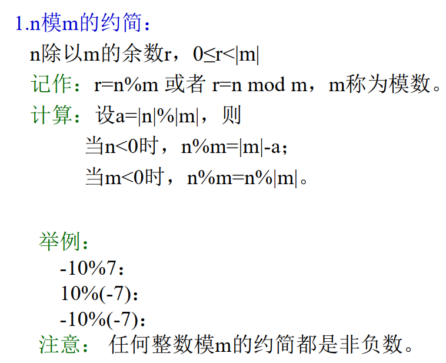
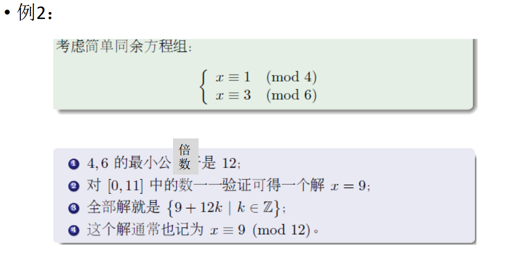

# 密码学回顾

## 传统加密技术

- **凯撒密码：**

由于凯撒密码很容易被找到规律，所以之后提出了Playfair和Hill，不再赘述。

- **密码加密技术：**

***置换：***

例子：

​	**代换**与**置换**不同，置换不更改所使用的字母，仅仅对其位置进行变换。而代换需要根据一个替换表来进行加密解密，具体如下：

-----

## 数论基础

### 整除

- **约简：**

> 注：任何整数模的约简都是非负数。

- **带余除法：**

- **辗转相除法：**

- **整数惟一分解定理：**

- **最小公倍数和最大公约数：**

  略。

- **互素：**

- **乘法逆元：**

- **乘法逆元的计算：**

**举例：**

### 同余与同余式

- **同余及其基本性质：**

- **剩余类和剩余系：**

  ==待学习==

- **欧拉函数：**

**欧拉函数的计算方法：**

> 对于n能够分解为两个素数，则结果等于两个素数减一相乘。但如果其分解后的素数个数大于2，则利用上面的万能公式。

- **一次同余式：**

**简单同余方程：**

**举例：（作业本上有类似习题解答，可参考）**

- **简单同余方程组举例：**

- **中国剩余定理：**

> 注：前提是m1, m2 ······, m~r~是两两互素的自然数。

**例子（作业本上有，可参考）：**

- **利用中国剩余定理求解同余方程组：**

### 二次剩余

- ==Legendre==

**待学习**

