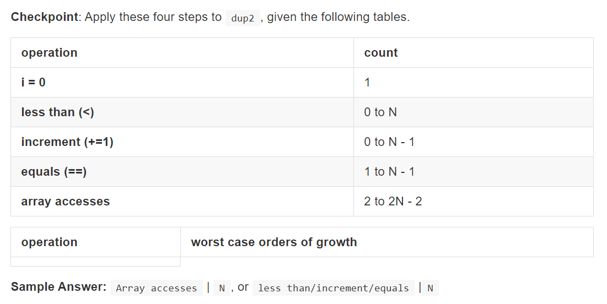
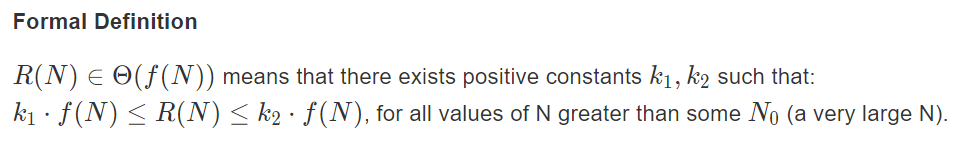
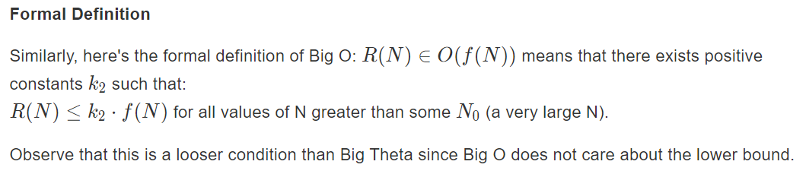

# Efficient Programming

## Encapsulation, API's, ADT's

​	对于效率，一般来说有两种说法：

1. 编程的效率
   - 开发周期
   - 程序的可扩展性、可读性以及可维护性。
2. 程序的消耗
   - 程序执行时间
   - 程序占用内存大小

​	对于CS61B-SP18，前七周主要对编程的效率进行了讲解。至此，Josh开始围绕“程序的消耗”进行讲解。

### Encapsulation

​	封装就是将程序的方法封装起来，外部可以通过文档来调用此接口而不必了解其内部技术细节。

### API'S

​	API就是应用程序接口（Application Programming Interface），它作为一种描述用来给开发人员进行使用。

API包括语法和语义的描述：

- 通过编译器检查API中的语法。
- 通过单元测试来检测API的语义（功能）。

### ADT'S

​	ADT是抽象数据结构（Abstract Data Structure）的简称，它在高层对功能进行定义和说明。

## Asymptotics I

​	由此开始，CS61B开始围绕**时间复杂度**和**空间复杂度**进行展开学习。

### 计算花销的方法

*方法一*

- 使用停表来计算程序运行时间（显然不靠谱）。
- 利用Unix中自带的time命令来计算时间。（可行）。
- 使用Princeton的Standard library，其中的stopwatch有相关用法。

*方法二A*

- 查看代码中某些部分所使用的操作数。
- 将specific operation的次数计算出来。（tedious...）

*方法二B*

- 不直接计算具体的次数，而是使用符号N（无限大）来表示次数。

​	对于计算/比较复杂度，我们一般来说只考虑最坏情况（也就是N无限大），此时我们将问题简化了一点，但这样看来有点不太严谨，因为它没有严格遵守数学推导，而是使用我们的intution。

> 这样思考：对于N^2^和N^3^，根据微积分的一些知识我们可以很容易看出来在N趋近于正无穷时后者比前者大了太多太多。所以说我们可以对其进行简化，仅提取对增长影响最大的项。

### 简化计算复杂度的方法

1. 仅考虑最坏情况。
2. Restrict Attention On One Operation。（需要练习才能知道选择哪一个Operation）
3. Eliminate Low Order Terms。
4. 忽略常数的影响。

引入一个例子：

答案是显而易见的。

### Big-Theta

​	为了表示时间复杂度，Josh引入了Big-Theta。可以将其表征为象征时间复杂度的符号。Theta代表了operation's order of growth。定义如下：

​	也就是说对于一个式子R(N)，其一定存在两个正数k1,k2使得在N趋近于无穷时R(N)的值夹在k1·f(N)和k2·f(N)之间。

- 例子：

  假设R(N) = (4N^2^+3N*ln(N))/2.

  那么其对应的f(N) = N^2^

  K1 = 1, K2 = 3.

### Big O

​	相比于Big-Theta，Big O与它不同的一点仅在于它可以用来表示"less than / equal"。

定义如下：

