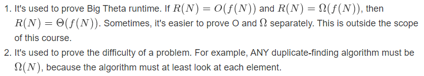

# Efficient Programming

## Encapsulation, API's, ADT's

​	对于效率，一般来说有两种说法：

1. 编程的效率
   - 开发周期
   - 程序的可扩展性、可读性以及可维护性。
2. 程序的消耗
   - 程序执行时间
   - 程序占用内存大小

​	对于CS61B-SP18，前七周主要对编程的效率进行了讲解。至此，Josh开始围绕“程序的消耗”进行讲解。

### Encapsulation

​	封装就是将程序的方法封装起来，外部可以通过文档来调用此接口而不必了解其内部技术细节。

### API'S

​	API就是应用程序接口（Application Programming Interface），它作为一种描述用来给开发人员进行使用。

API包括语法和语义的描述：

- 通过编译器检查API中的语法。
- 通过单元测试来检测API的语义（功能）。

### ADT'S

​	ADT是抽象数据结构（Abstract Data Structure）的简称，它在高层对功能进行定义和说明。

## Asymptotics I

​	由此开始，CS61B开始围绕**时间复杂度**和**空间复杂度**进行展开学习。

### 计算花销的方法

*方法一*

- 使用停表来计算程序运行时间（显然不靠谱）。
- 利用Unix中自带的time命令来计算时间。（可行）。
- 使用Princeton的Standard library，其中的stopwatch有相关用法。

*方法二A*

- 查看代码中某些部分所使用的操作数。
- 将specific operation的次数计算出来。（tedious...）

*方法二B*

- 不直接计算具体的次数，而是使用符号N（无限大）来表示次数。

​	对于计算/比较复杂度，我们一般来说只考虑最坏情况（也就是N无限大），此时我们将问题简化了一点，但这样看来有点不太严谨，因为它没有严格遵守数学推导，而是使用我们的intution。

> 这样思考：对于N^2^和N^3^，根据微积分的一些知识我们可以很容易看出来在N趋近于正无穷时后者比前者大了太多太多。所以说我们可以对其进行简化，仅提取对增长影响最大的项。

### 简化计算复杂度的方法

1. 仅考虑最坏情况。
2. Restrict Attention On One Operation。（需要练习才能知道选择哪一个Operation）
3. Eliminate Low Order Terms。
4. 忽略常数的影响。

引入一个例子：


答案是显而易见的。

### Big-Theta

​	为了表示时间复杂度，Josh引入了Big-Theta。可以将其表征为象征时间复杂度的符号。Theta代表了operation's order of growth。定义如下：


​	也就是说对于一个式子R(N)，其一定存在两个正数k1,k2使得在N趋近于无穷时R(N)的值夹在k1·f(N)和k2·f(N)之间。

- 例子：

  假设R(N) = (4N^2^+3N*ln(N))/2.

  那么其对应的f(N) = N^2^

  K1 = 1, K2 = 3.

### Big O

​	相比于Big-Theta，Big O与它不同的一点仅在于它可以用来表示"less than / equal"。

定义如下：


## Asymptotic II

​	第二部分主要围绕第一部分的内容进行了实战分析，通过实际的例子来阐述应用。

### 循环例子一

对于一个循环：

``````java
int N = A.length;
for (int i = 0; i < N; i += 1)
   for (int j = i + 1; j < N; j += 1)
      if (A[i] == A[j])
         return true;
return false;
``````

​	对于上述代码，如果需要计算其时间复杂度，根据“计算复杂度的方法”，我们需要先找到一个操作，此时我们考虑 A[i] == A[j] 这句的的执行情况。对于最坏情况，第一次执行外层循环，内部循环需要执行N-1次，第二次执行外部循环，内部循环需要执行N-2次，以此类推，它总共需要：

​	*C*=1+2+3+...+(*N*−3)+(*N*−2)+(*N*−1)=*N*(*N*−1)/2

​	这也就相当于Theta(N^2^)。

​	当然，也有另外一种方法，就是以图形的方式表述出来，通过看其表示的面积来计算出时间复杂度：


### 循环例子二

```java
public static void printParty(int N) {
   for (int i = 1; i <= N; i = i * 2) {
      for (int j = 0; j < i; j += 1) {
         System.out.println("hello");   
         int ZUG = 1 + 1;
      }
   }
}
```

​	对于上面这个例子，如果直接考虑最坏情况，则很难直接看出其时间复杂度，那么此时就需要对其进行尝试，尝试使用数学归纳法或“找规律”的形式来找到其时间复杂度。

考虑 Sout 操作的时间复杂度：

- 当N = 1时，操作1次。
- 当N = 2时，操作1 + 2 = 3次。
- 当N = 4时， 操作1 + 2 + 4 = 7次。
- ......

由此可以得到一张比较直观的图：


​	这是Josh上课所用的一张图，可以看出当N为2的倍数时，其值为 *C(N) = 1 + 2 + 4 + ... + N* 。那么我们就可以认为其时间复杂度为Theta(N)，属于线性增长。

但这样描述总会让人有些不理解，那么可以绘制一个图形，其中包含此线和其他线，使其满足Big-Theta的定义即可：


​	上图中红线代表sout的时间复杂度曲线，两个虚线分别代表4N和0.5N。由此可以明显看出存在两个实数4，0.5使得其分别大于和小于此复杂度曲线，符合定义，故其时间复杂度为Theta(N)。（公式：*C*(*N*)=1+2+4+...+*N*=2*N*−1 (again if N is a power of 2)）

### 对于时间复杂度的计算无捷径可言

​	Josh上课时说过，对于时间复杂度的计算没有什么捷径(no magic shortcut)，并不是所有的双层循环其复杂度都为N^2^。所以只能仔仔细细，一步一步地推敲。

技巧：

- Find exact sum
- Write out examples
- Draw pictures

另外需要知道的：

- 1+2+3+...+*Q*=*Q*(*Q*+1)/2=Θ(*Q*^2^) (Sum of First Natural Numbers)
- 1+2+4+8+...+*Q*=2*Q*−1=Θ(*Q*) (Sum of First Powers of 2)

​	有了上述的知识储备，之后再计算复杂度就不会出现什么问题了。

### 递归例子

```java
public static int f3(int n) {
   if (n <= 1) 
      return 1;
   return f3(n-1) + f3(n-1);
}
```

对于递归，我们可以将其描述为一个递归树，对于f(4)：


​	通过f(4)可以清晰的看出，它有2^4-1^个返回值，也就是说在N的情况下，其返回值有2^N-1^个。通过直觉来看，其运行时间也就是2^N^。

​	严格的数学推导：

对于`f3`，计算调用的次数：

C(4) = 1 + 2 + 4

那么C(N) = 1 + 2 + 4 + ... + 2^N-1^

根据公式，C(N) = 2(2^N-1^) - 1 = 2^N^-1

由此可以得出其时间复杂度为Theta(2^n^)。

### 二分查找例子


​	对于上述代码，此二分查找使用了递归的写法，我们以调用方法的次数作为操作次数。最坏情况得下表：


​	可以发现，在N为二的倍数时次数为log~2~(N)，更精确一点的说法是：


L形状的符号代表向下取整，类似于"floor"方法。

- 另外需要知道的：


所以为Theta(logN)。

### 归并排序例子

首先回顾一下选择排序的步骤：

- 找到序列中最小的项，将其放在”首部“。
- 将未排序的项使用归并排序进行排序。

通过画图可以清楚的看出，其复杂度为Theta(N^2^)


​	对于归并排序，如果现在有两个已经排序好了的列表，现想将这两个列表合并一起，其形式仍为排序后的形式。那么我们可以使用归并排序，将这两个列表的首部进行写入，然后一个一个追加即可，其复杂度为Theta(N)。

​	对于归并排序这么好的性能，我们考虑将选择排序和归并排序结合起来，以达到最佳性能。

方法：

​	因为选择排序时间太久，在归并排序中，我们每split一次，其时间就会少一点，如果我们”极端“一点，将列表split到仅剩余一项，这样就相当于得到了N个列表，然后将这N个列表使用归并排序排序拼接即可。拼接所需要用时为Theta(N)，对于N个长度的列表，其总共需要log~2~(N)次循环，那么显而易见地，其总共用时为log~2~(N)*N，时间复杂度也就是Theta(nlog(n))。

> 这个例子十分有趣，理解需要自己思考思考。有疑问参看[链接](https://joshhug.gitbooks.io/hug61b/content/chap8/chap83.html)。

## Omega and Amortized Analysis

### 小栗子

分析下面代码的时间复杂度：

```java
public boolean dup3(int[] a) {
    int N = a.length;
    for (int i = 0; i < N; i += 1) {
        for (int j = 0; j < N; j += 1) {
            if (a[i] == a[j]) {
                return true;
            }
        }
    }
    return false;
}
```

​	通过观察，无论数组a的长度等于几，这个方法始终会返回true。故R(n) = Theta(1)。

---

分析第二个：

```java
public boolean dup4(int[] a) {
    int N = a.length;
    for (int i = 0; i < N; i += 1) {
        for (int j = i + 1; j < N; j += 1) {
            if (a[i] == a[j]) {
                return true;
            }
        }
    }
    return false;
}
```

​	这个相比于之前的难了一点，但如果记住了之前的公式，细心推导还是可以发现在最坏的情况下它和累加和是相同的(也就是Theta(n^2^))。但是，如果当a的长度发生变化时，其R(n)仍旧会发生变化，也就是说影响其时间复杂度的有数组的长度和重复与否。所以如果是最好情况下(数组中全是重复的)，那么其R(n)就是Theta(1)。

​	这个栗子显示出了Big Theta的缺点，Big Theta可以表示一个方法与数组长度有关的特性，但如果这个方法的复杂度不仅仅制约于数组长度(比如有其他影响因素)，那么使用Big O是更合适的，因为Big O描述的是一种小于等于的状态，此时只需要考虑最坏甚至更坏即可。

### Big O Abuse

​	Josh给了一个很有意思的例子来让我们思考哪句话提供的信息是更informative的，如下：


**Note：**Big O is NOT the same as "worst case". But it is often used as such.

Big O的用处总结：

- 在运行时间因为不同的输入而变化时，我们可以使用它来对算法做一个简单的陈述。
- 对于一些tricky的问题，我们不知道其真正的runtime，所以我们只能陈述其更高的时间。
- 证明Big O比Big Theta简单得多，课程不做要求。

### Big Omega

​	相比于Big O和Big Theta，Big Omega是与之相反的定义：


两种用法：



(暂时还未体会到其真正的用法...)

三个Big的总结：


### Amortized Analysis (Intuitive Explanation)

考虑一下两种情况：

1. 每天给一个人3￥。
2. 一段时间给一个人一部分钱：
   - 第1天给1￥。
   - 第2天给2￥。
   - 第4天给4￥。
   - 第8天给8￥。

​	对于第一种情况，我们每天都要给一个人3￥，看起来比第二天的要好一些，但实际情况确实第二种情况比第一种情况更省钱！我们可以将第二天的钱数给平摊成每天2￥，这样每次给钱时还能剩余1￥，肯定是要比第一种情况更优的！这就是所要说的平坦常数(amortized constant)。

#### AList Resizing and Amortization

对于之前做过的AList的resize，有以下两种实现形式：

Implementation 1:

```java
public void addLast(int x) {
  if (size == items.length) {
    resize(size + RFACTOR);
  }
  items[size] = x;
  size += 1;
}
```

Implementation 2:

```java
public void addLast(int x) {
  if (size == items.length) {
    resize(size * RFACTOR);
  }
  items[size] = x;
  size += 1;
}
```

​	第一种实现肯定是非常糟糕的(可以在Linux中进行测试，性能很差!) 因为在每次插入一个数据时都需要将原来的所有数据项copy到一个新的长度加一的列表中，它无疑耗费了巨大性能。

​	但对于第二种实现形式，我们使得RFACTOR = 2，当列表满了的时候它会自动扩充两倍容量，大多数add操作都是Theta(1)，某些操作可能会比较耗时。但如果我们将其总和平摊下来我们会发现其实它是Theta(1)的。如图：


### Amortized Analysis (Rigorous Explanation)

其实就是分析地细致化了一点，和之前的两个分析是大差不差的。具体的省略，可以参看[链接](https://joshhug.gitbooks.io/hug61b/content/chap8/chap84.html)。

**总结**：

