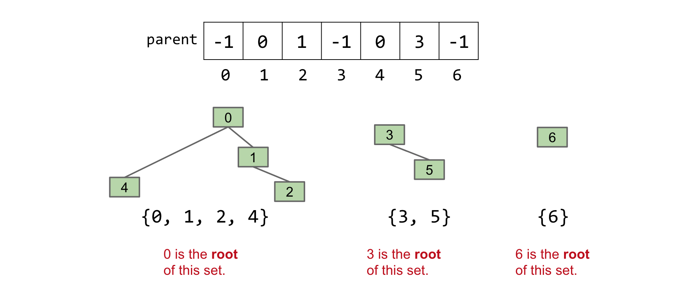
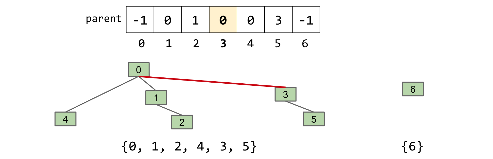
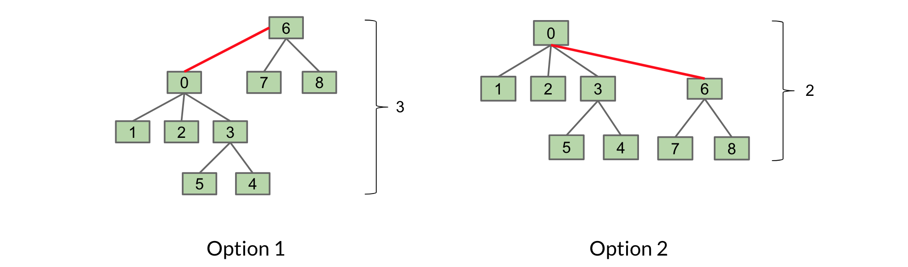

# Disjoint Sets

## Intro

- 什么是`Disjoint Set`?

​	`Disjoint Set`其实就是不相交的集合(两个集合中的元素没有重复的，那么就称这两个集合是不相交集合<也可以叫做`Disjoint Set`)，这是数学中的定义。

​	在计算机科学中，`Disjoint Set`是一种树型的DS，它用于处理一些`Disjoint Sets`的合并以及查询问题，这个DS一般来说有两个操作：

1. `connect(x, y)`: connect `x` and `y`. Also known as `union`
2. `isConnected(x, y)`: returns true if `x` and `y` are connected (i.e. part of the same set).

这里有一些[相关的例子](https://joshhug.gitbooks.io/hug61b/content/chap9/chap91.html)可以加深理解。

由此，我们可以定义一个接口将`Disjoint Set`的行为给表示出来而不用实现它(此时仅考虑非负数)：

```java
public interface DisjointSets {
    /** connects two items P and Q */
    void connect(int p, int q);
    
    /** check to see if two items are connected */
    boolean isConnected(int p, int q);
}
```

## Quick Find

### ListOfSets

​	基于Intro的接口，我们想到的实现此接口的方法一般来说是创建一个以集合为元素的列表，例如`List<Set<Integer>>`。

​	对于这种方式，如果我们有0-6共六个元素并且每个元素代表一个集合，他们存放在一个列表中，如：`[{0}, {1}, {2}, {3}, {4}, {5}, {6}]`，如果我们想要实现`connect(5, 6)`，那么我们需要遍历这个列表找到含5的集合并找到含6的集合，之后再将两者连接起来，它的运行时间是`O(N)`。虽然看起来简单，但实现其实是比较复杂的。

### Quick Find

来看一个元素全是整数的数组：

- 将数组的下标表示为集合中的元素。
- 将下标对应的元素表示集合的标识。

例如对于`{0, 1, 2, 4}, {3, 5}, {6}`：


下标是对应的元素，下标对应的数值是集合的标识。

> 注：下标对应的数值可以并不一定是4、5等等，可以为任意的数字，但需要保证不同的集合之间有区分度。

- `connect(x, y)`

​	假如此时需要调用`connect(2, 3)`，那么先把值为`id[2]`的元素表示出来，然后找到值为`id[3]`的元素，之后将其中一类的值指定为另一类的值(即将两组值相同)即可。如josh的例子：


- `isConnected(x, y)`

​	比较x和y简直不要太容易，直接比较下标对应的值即可，如果`id[x] == id[y]`，那就true；反之不行。

### Summary and Code

- 总结

| Implementation | Constructor                                                  | `connect` | `isConnected` |
| -------------- | ------------------------------------------------------------ | --------- | ------------- |
| ListOfSets     | Θ(N)[1](https://joshhug.gitbooks.io/hug61b/content/chap9/chap92.html#fn_1) | O(N)      | O(N)          |
| QuickFind      | Θ(N)                                                         | Θ(N)      | Θ(1)          |

**QuickFind的实现：**

```java
public class QuickFindDS implements DisjointSets {

    private int[] id;

    /* Θ(N) */
    public QuickFindDS(int N){
        id = new int[N];
        for (int i = 0; i < N; i++){
            id[i] = i;
        }
    }

    /* need to iterate through the array => Θ(N) */
    public void connect(int p, int q){
        int pid = id[p];
        int qid = id[q];
        for (int i = 0; i < id.length; i++){
            if (id[i] == pid){
                id[i] = qid;
            }
        }
    }

    /* Θ(1) */
    public boolean isConnected(int p, int q){
        return (id[p] == id[q]);
    }
}
```

## Quick Union

​	假设我们现在需要对`connect`操作进行优化，由于之前的Quick Find操作是在一个数组上进行的，我们现在仍然使用数组。之前表示元素使用的是数组的下标，值代表集合的类别。现在更改一下，我们使用值来代表当前元素的父母(parent)，对于根(root)其值为负数。

例如：



​	我们仍然使用了一个数组来表示，下标仍然对应元素，数组里的值代表当前元素的parent。通过上图不难看出其对应关系，省略。

​	但对于QuickUnion，当需要实现`connect`操作时要找到对应元素的root，也就是说我们需要一个helper method叫做`find(int item)`来找到`item`的root，如`find(4) == 0`, `find(1) == 0`, `find(5) == 3`, etc。进而才可以实现`connect`。

假设此时需要调用`connect(5, 2)`：

1. `find(5)` -> 3
2. `find(2)` -> 0
3. 将`find(5)`的值与`find(2)` 的值相等，也就是连接




`isConnected(x, y)`

比较这两个就很简单了，直接调用辅助函数`find(x) == find(y)`进行比较就完事了。

- **性能表现**

​	对于人们的常理来说，这个的`connect`性能是比较不错的，但是在QuickUnion中的两个函数都需要基于辅助函数`find`来实现，也就是说我们需要评估`find`函数的性能。

假设当树只有一个分支的话，那么其长度是巨大的，此时使用`find`函数在最坏请跨国下需要遍历整个树(Theta(N))，如图：


​	因此想要提升其性能，就必须保证树的分支(Height/Weight)尽可能的小，我们下面讨论的WQU(Weighted Quick Union)会着力解决这个问题。

### Summary and Code

- **总结**

| Implementation | Constructor | `connect` | `isConnected` |
| -------------- | ----------- | --------- | ------------- |
| QuickUnion     | Θ(N)        | O(N)      | O(N)          |
| QuickFind      | Θ(N)        | Θ(N)      | Θ(1)          |
| QuickUnion     | Θ(N)        | O(N)      | O(N)          |

N代表DisjointSets里面的元素数量。

- **QuickUnion的实现**

```java
public class QuickUnionDS implements DisjointSets {
    private int[] parent;

    public QuickUnionDS(int num) {
        parent = new int[num];
        for (int i = 0; i < num; i++) {
            parent[i] = i;
        }
    }

    private int find(int p) {
        while (parent[p] >= 0) {
            p = parent[p];
        }
        return p;
    }

    @Override
    public void connect(int p, int q) {
        int i = find(p);
        int j= find(q);
        parent[i] = j;
    }

    @Override
    public boolean isConnected(int p, int q) {
        return find(p) == find(q);
    }
}
```

## Weighted Quick Union(WQU)

接上次在Quick Union中说到，其`connect`和`isconnected`都基于辅助函数`find`，要想使得性能最佳那么就需要树变得更“短”一点。

**新规则：**当我们调用`connect`方法时，我们总是将更小的树挂载更大的树上。

> 思考：有几种方式来判断树的大小呢?
>
> 对于WQU，我们以树的元素个数作为衡量一个树大小的标准。当然，对于其他的树我们也可以以树的高度作为衡量树大小的标准，只是对于WQU来说我们规定了以元素个数为衡量大小的依据。

图示说明：

​	这是树T1和T2的初始状态：


​	由此我们有两种连接这两个树的方式：



​	第一种是将T1挂在T2上(显然不符合我们新定义的规矩)，第二种是将T2挂在T1上(很好，正是我们想要的)。

### Maximux height: Log N

​	其实有一定的数学知识就很好理解为什么*maximux height of the tree is Θ(log N)*。(N是Disjoint Sets的元素个数)。

​	根据之前定义的规则，我们总是偏好于将更小的树挂载到更大的树上，也就是说，对于root，其至少有两个分支。当树的高度达到最高时，其两个分支中一个元素占一个单元的高度，总的元素个数为N，那么2^x^ + 1 = N，可以得出`x = log2(N-1)` ，也就相当于Θ(log N)。  

### Summary and Code

| Implementation       | Constructor | `connect` | `isConnected` |
| -------------------- | ----------- | --------- | ------------- |
| QuickUnion           | Θ(N)        | O(N)      | O(N)          |
| QuickFind            | Θ(N)        | Θ(N)      | Θ(1)          |
| QuickUnion           | Θ(N)        | O(N)      | O(N)          |
| Weighted Quick Union | Θ(N)        | O(log N)  | O(log N)      |

Code详见Lab6.

## WQU with Path Compression

​	回想之前的`find`方法，它需要从选定的元素开始遍历直到root，但是如果对于元素一个一个进行遍历的话会比较耗时，因此可以提出一个新的方案。

​	由于在每次`find`方法执行时，它都会向上寻找parent，在这个过程中我们可以把其parent与root相连，这样形成的集合结构不会有变化但其形成的树的高度会变低，进而降低了寻找的次数。

​	具体过程见[视频详解](https://www.youtube.com/watch?v=DZKzDebT4gU&feature=emb_logo)。

### Summary

N: number of elements in Disjoint Set

| Implementation             | `isConnected` | `connect` |
| -------------------------- | ------------- | --------- |
| Quick Find                 | Θ(N)          | Θ(1)      |
| Quick Union                | O(N)          | O(N)      |
| Weighted Quick Union (WQU) | O(log N)      | O(log N)  |
| WQU with Path Compression  | O(α(N))*      | O(α(N))*  |

Code in lab6。