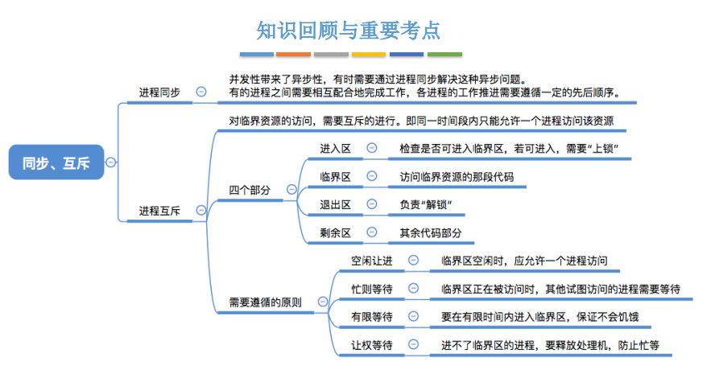
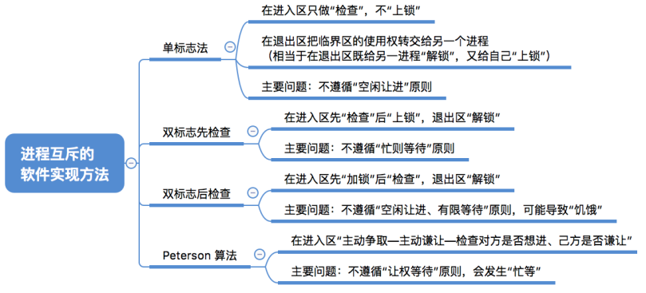
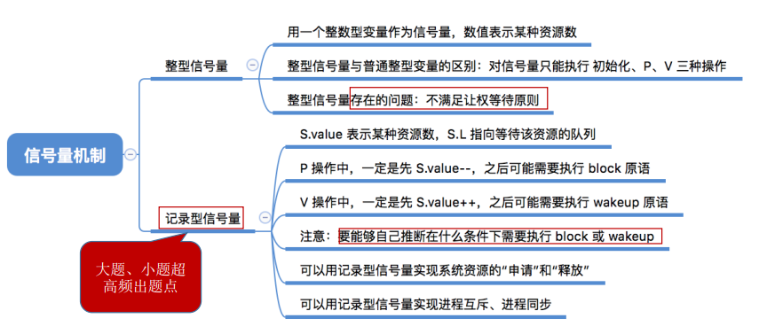
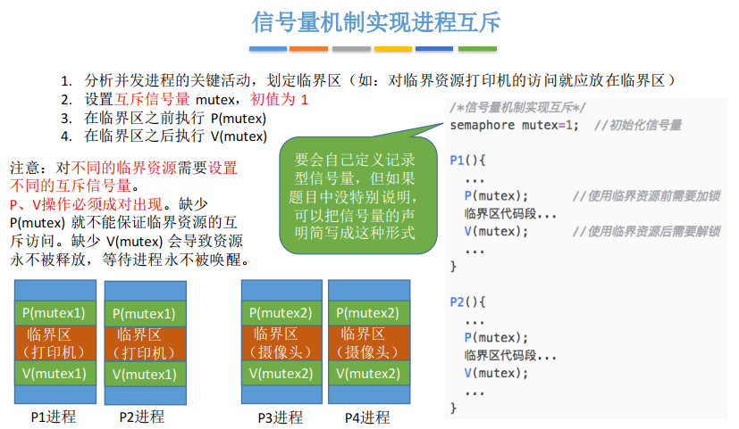
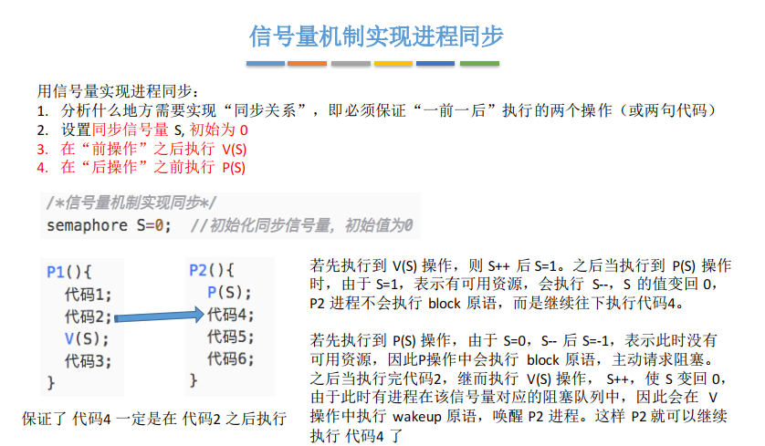
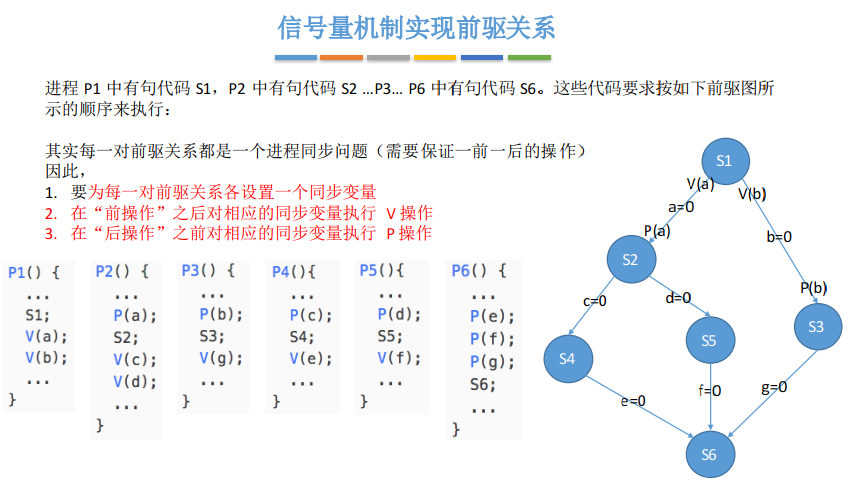

# 操作系统

## 1. 操作系统概述

## 2. 进程

### 2.1 进程调度

### 2.2 进程同步、互斥

- **进程同步、互斥的基本概念：**

  其中**四个原则**需要理解并记忆。

- **进程互斥的软件实现方法：**

  - 单标志法
  - 双标志先检查法
  - 双标志后检查法
  - Peterson算法

  [四种算法的具体实现](https://www.bilibili.com/video/BV1YE411D7nH?p=19)

  

上图是四种算法的比较。

- **[进程互斥的硬件实现方法](https://www.bilibili.com/video/BV1YE411D7nH?p=20)**

- **信号量机制：**

  之前的四种进程互斥的软件实现都没有实现“**让权等待**”，为此开始讨论信号量机制。

  用户进程通过使用OS提供的一对原语对信号量进行操作。原语其执行只能一气呵成，不可被中断。其中的阻塞原语wait成为P操作，唤醒原语成为V操作。

  - 整型信号量
  - 记录型信号量

- 信号量实现进程互斥、同步问题

  - 信号量实现互斥

  

  互斥信号量初值设置为1，是因为要想实现不同进城互斥访问临界区共享资源，那么首先要让一个进程实现P操作，此时其他进程不在拥有访问临界区的权利，在当前进程访问结束后再进行V操作即完成了对临界区的一次互斥访问。

  - 信号量实现同步

  

  同步信号量初值设置为0，是因为同步操作是有前后顺序的，然后操作系统调度通常是异步进行的，为了规定前后才使用同步信号量。比如对于单生产者-单消费者模型：消费者必须在生产者生产后才可以消费，也就是说必须使得同步信号量大于0才能被消费者实现P操作，所以必须在生产者生产后实现一个V操作。

  - 信号量实现前驱关系

  

- 

  