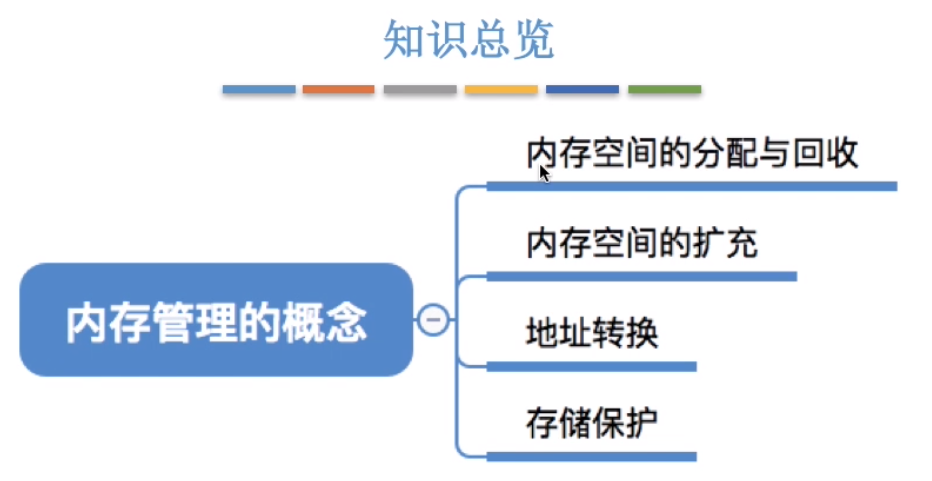

# 操作系统

## 1. 操作系统概述

## 2. 进程

### 2.1 进程调度

### 2.2 进程同步、互斥

- **进程同步、互斥的基本概念：**

  其中**四个原则**需要理解并记忆。

- **进程互斥的软件实现方法：**

  - 单标志法
  - 双标志先检查法
  - 双标志后检查法
  - Peterson算法

  [四种算法的具体实现](https://www.bilibili.com/video/BV1YE411D7nH?p=19)

  

上图是四种算法的比较。

- **[进程互斥的硬件实现方法](https://www.bilibili.com/video/BV1YE411D7nH?p=20)**

- **信号量机制：**

  之前的四种进程互斥的软件实现都没有实现“**让权等待**”，为此开始讨论信号量机制。

  用户进程通过使用OS提供的一对原语对信号量进行操作。原语其执行只能一气呵成，不可被中断。其中的阻塞原语wait成为P操作，唤醒原语成为V操作。

  - 整型信号量
  - 记录型信号量

- **信号量实现进程互斥、同步问题:**

  - 信号量实现互斥

  

  互斥信号量初值设置为1，是因为要想实现不同进城互斥访问临界区共享资源，那么首先要让一个进程实现P操作，此时其他进程不在拥有访问临界区的权利，在当前进程访问结束后再进行V操作即完成了对临界区的一次互斥访问。

  - 信号量实现同步

  

  同步信号量初值设置为0，是因为同步操作是有前后顺序的，然后操作系统调度通常是异步进行的，为了规定前后才使用同步信号量。比如对于单生产者-单消费者模型：消费者必须在生产者生产后才可以消费，也就是说必须使得同步信号量大于0才能被消费者实现P操作，所以必须在生产者生产后实现一个V操作。

  - 信号量实现前驱关系

  

- **生产者消费者模型：**

  
  
  但对于生产者消费者模型，其中对重要的就是如何定义互斥信号量和同步信号量。通过分析此问题，我们可以发现两个对象之间对缓冲区需要进行互斥访问，但同时也需要满足“生产-消费”的同步关系。
  
- **多生产者多消费者模型：**

  具体例子就是父亲母亲和儿子女儿的水果问题，[详见](https://www.bilibili.com/video/BV1YE411D7nH?p=24)。

  

- **单生产者多消费者模型：**

  具体例子就是[吸烟者问题](https://www.bilibili.com/video/BV1YE411D7nH?p=25)

  

- **读者-写者问题/哲学家进餐问题：**见王道视频。

- **管程：**

### 2.3 死锁

#### 死锁的基本概念

- **死锁、饥饿、死循环的定义及其区别：**

- **死锁产生的必要条件：**

  死锁的产生必须遵循上图表示的四个条件，缺一不可！

- **死锁的处理策略：**

- **死锁总结：**

#### 预防死锁

- 由上可知，死锁的产生必须要满足四个条件，如果想要预防死锁的产生，那么我们可以破坏死锁的四个条件，具体如下：

- **总结：**

​	主要是对内容进行理解和记忆。

#### 避免死锁

- **安全序列、不安全状态与死锁：**

> 牢记一句话：如果系统处于安全状态，就一定不会发生死锁，但是如果系统进入不安全状态，那么它就有可能发生死锁。

- **银行家算法：**

​	银行家算法是***重点***，其核心思想还是考虑给进程分配资源时是否会进入不安全状态，通过判断进而进行操作。

> 在对银行家算法进行做题（手算）时，我们需要往最坏的方向去想。所有的假设条件都是基于最坏的情况来定，如果最坏的情况都可以保证安全序列，那就代表系统进入了安全状态。

上图即银行家算法的流程。

- **总结：**

#### 死锁的检测和解除

- **死锁的检测：**

  

​		死锁的检测是本节的重点，应当熟悉如何检测死锁。

- 死锁的解除

- **总结：**

## 3. 内存管理

### 3.1.1 内存的基本知识

- **内存/存储单元的定义：**

- **指令：**

- **逻辑地址和物理地址：**

​		逻辑地址相当于相对地址，不代表真正的地址；而物理地址则是实打实的地址。

- **程序的编译、链接、装入过程：**

> 其中在装入的过程中有三种方式：绝对装入、静态重定位、动态重定位。

- **绝对装入：**

​		绝对装入就是直接将程序的物理地址指定出来，进而将程序存放到指定的地址当中去。

- **静态重定位：**

​		**静态重定位**相当于计算机组成中的基址寻址方式（个人认为）。

- **动态重定位：**

​		**动态重定位**相比于静态重定位其好处在于它在运行时才将逻辑地址转换为物理地址，并且当程序发生移动时它的物理地址可以根据重定位寄存器的值而相应地进行变化，但静态重定位仅仅可以在一开始装入时就将逻辑地址转化为物理地址，当程序移动时会发生错误。

- **总结：**

### 3.1.2 内存管理的概念

- **知识总览：**

- **总结：**

​		具体的介绍详见[视频](https://www.bilibili.com/video/BV1YE411D7nH?p=34)，不再赘述。

### 3.1.3 覆盖与交换

- **覆盖：**

Ex:

​		由上图，由于B、C以及D、E、F均为互斥关系，也就是在目标层只会调用其中的一部分。为了解决内存问题，使用覆盖技术可以解决一定的问题。

- **交换：**

- **总结：**

​		本节内容仅需理解即可。

### 3.1.4 **连续分配管理方式**

- 